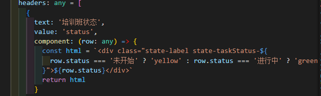
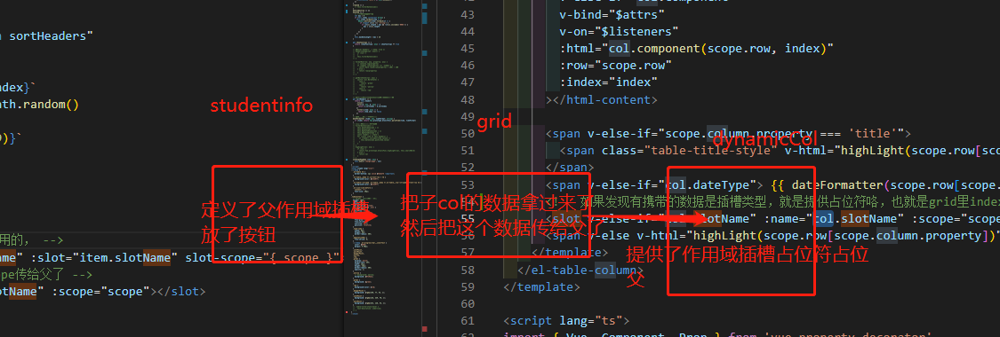
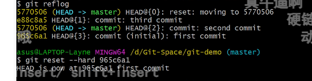
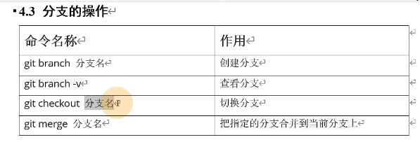
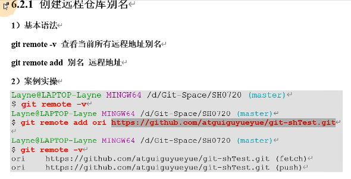
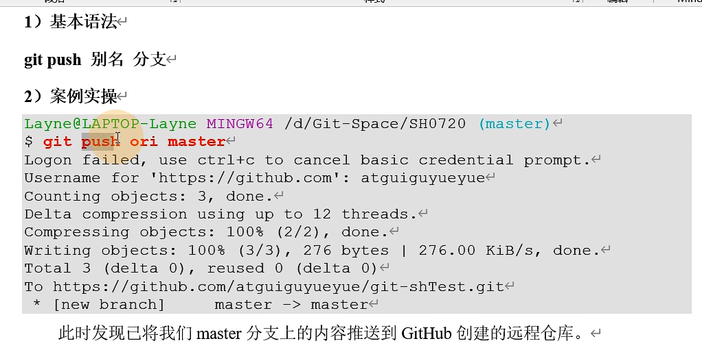

#### 学习内容：

.sync 修饰符

没搞懂和v-on="$listeners"、v-bind=“$attrs有什么区别

在对一个 prop 进行“双向绑定,单向修改”的场景下--好像项目里也不是这个场景，因为子组件不能直接修改父组件，sync在2.3版本引入，作为一个事件绑定语法糖，利用[EventBus]，当子组件触发事件时，父组件会响应事件并实现数据更新，避免了子组件直接修改父组件传过来的内容。

.sync是一个语法糖。是父组件监听子组件更新某个props的请求的缩写语法

就是省写了$emit和父组件中回调函数，达到直接修改数据，荣哥说就当隔组件使用v-model，特别注意prop写法


```text
:money.sync="tatol"//等价
:money="total" v-on:update:money="total=$event"
```


$attrs---它是组件自身的一个属性，可以获取到传递给组件的所有没有用props声明接收的prop属性，除了class、style属性

提醒：prop 传递的属性不会被接收。父组件用prop接收了一些数据，那在子里面就不会$attr接收这些数据

prop 就想当于吃流水席，把自己想要的东西截下来了？


项目中我的疑问：怎么我把eltable里的v-bind="$attrs"删掉也能用，我没看到它怎么用的，我需要知道这是具体怎么用的

项目中我的理解：我需要在eltable里的table和table-column其实是父子关系封装的，但在我只是用eltable ，我不关心内部，只传东西给eltable，这个时候就需要在调用table-colum时写

<el-table-column v-if="showCheckbox" type="selection" v-bind="$attrs" v-on="$listeners"

让这个子组件接受父组件同样的东西，使得table，table-colum看起来是同层次的东西

[(181条消息) Vue中 $attrs、$listeners 详解及使用_明天也要努力的博客-CSDN博客](https://blog.csdn.net/ZYS10000/article/details/116017711)


#### 项目讲解：v-on="$listeners"、v-bind=“$attrs部分

managent页面：



headers里面加了想要加这样的样式的，一定要加component，后面会提到用到了table-col自带插槽里


Grid里的 :total="total"，就是通过v-bind=“$attrs传给子了的，没人用prop接收


```
      <html-content
        v-else-if="col.component"
        v-bind="$attrs"
        v-on="$listeners"
        :html="col.component(scope.row, index)"
        :row="scope.row"
        :index="index"
      ></html-content>
```

DynamicColumn组件下自己写了htmlContent组件

```
   htmlContent: {
      props: {
        html: String,
        row: Object,
        index: Number
      },
      render (h: any) {
        const self: Vue = this
        const component = Vue.extend({
          template: `<div @click.stop="onComponentClick">${self.$props.html}</div>`,
          methods: {
            onComponentClick () {
              this.$children.forEach((item: any) => {
                self.$emit(item.$attrs.clickName, self.$props.row, self.$props.index)
              })
            }
          }
        })

        return h(component, {
          // on: {
          //   click: function() {
          //     console.log(111)
          //     ;(self as any).aaa()
          //   }
          // }
        })
      }
    }
```

   template: `<div @click.stop="onComponentClick">${self.$props.html}</div>`,

这里的${self.$props.html}

外面

 :html="col.component(scope.row, index)"

col是sortHeaders里的遍历的item

喏，就是这里component


​      this.$children.forEach((item: any) => {

荣哥说，外面一定要用component的原因，要不然这里遍历的就是空元素了（没有children）$children是指这个下面的整个组件，不是元素啥的


item.$attrs.clickName,   指的是哪个方法

 如果heade里的component如果有点击方法，就执行咯，(还是问一问吧)


#### 疏通插槽

数据是一路往下传的，

header=> sortHeaders=>col

headers里的value 对应 eltable的prop，label（表头）对应text

 :label="col.text"		  :prop="col.value"


**没搞懂这里:slot、		:name是怎么用的**

item.slotName" :slot="item.slotName" 

就是传值而已:slot  ,设了个属性名传进去了   就是指的col里面的name吧？（疑惑）

下面的：name也是这样的

但是好像没看到哪里用了slot这样属性


是把上面的name、scope传给父studenInfo了吗

```
        <template #operate="{ scope }">
          <el-button class="color-green" @click.native.stop="toDetail(scope.row, '详情')" type="text"
            >学员详情</el-button
          >
          <el-button class="color-green" @click.native.stop="toDetail(scope.row, '学习考试记录')" type="text"
            >考试记录</el-button
          >
        </template>
```





  studentInfo组件部分：

<template #operate="{ scope }">

​     <el-button class="color-green" @click.native.stop="toDetail(scope.row, '详情')" type="text"

​      \>学员详情</el-button

​     \>

​     <el-button class="color-green" @click.native.stop="toDetail(scope.row, '学习考试记录')" type="text"

​      \>考试记录</el-button

​     \>

​    </template>

grid组件部分：

​    <!-- 这是作用域插槽父组件里用的， -->

​     <span v-if="item.slotName" :slot="item.slotName" slot-scope="{ scope }">

​      <!-- 把上面的name、scope传给父了 -->

​      <slot :name="item.slotName" :scope="scope"></slot>

​     </span>

dynamic-colum组件部分：

```
  <!-- elementui的el-col自带插槽，提供给你让你可以修改列内容格式的 -->
    <template slot-scope="scope">
      <div
        v-if="col.template"
        @click.stop="onTemplateClick($event, scope.row, index)"
        v-html="col.template(scope.row, index)"
      ></div>
      <html-content
        v-else-if="col.component"
        v-bind="$attrs"
        v-on="$listeners"
        :html="col.component(scope.row, index)"
        :row="scope.row"
        :index="index"
      ></html-content>
		.....
      <!-- 如果发现有携带的数据是插槽类型，就是提供占位符咯，也就是grid里index里的添加的作用域插槽 -->
      <slot v-else-if="col.slotName" :name="col.slotName" :scope="scope" />
    </template>
```

#### GIT

git config --list


git stash						list  /   pop

git pull			origin dev

 git credential-manager uninstall

 


##### 学习内容

查看log








推送本地库到远程库

最小单位是分支




