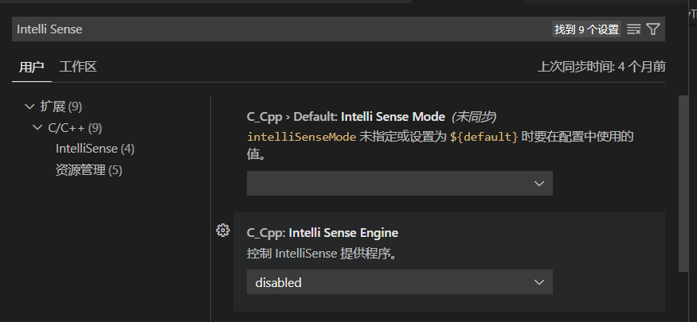
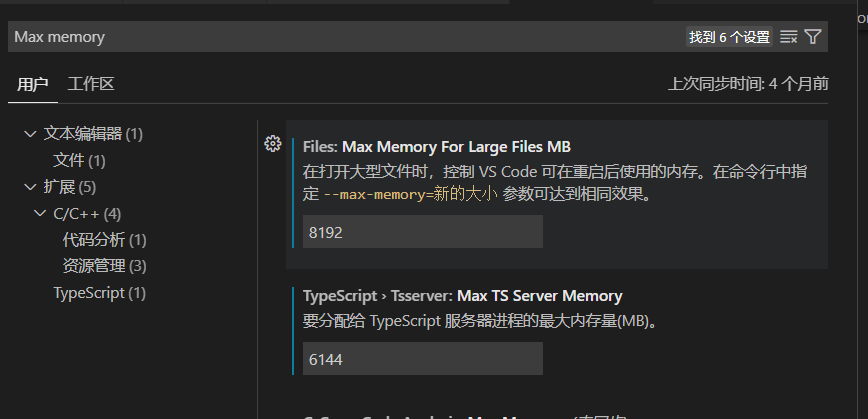

## 日报

已完成：

​	1.信用农安平台_日常监管下的宣传培训乡镇版的乡镇和区县两个的页面的切图及接口联调，宣传培训页面的切图及数据显示以及详情弹窗页面的切图和文本数据的回显

未完成：

日期的forma格式化

监管培训的查询等按钮功能（类型在接口上传参要传数据）

弹窗的图片回显（参照reviewedDetail)

## 任务

我想先有个整体的认知

信用农安_日常监管__宣传培训

日常监管下，添加宣传培训，分市级和区县两个页面（跟主题信息乡镇版一样）

```
管理员账户被特殊处理，无法判断权限
改为
查看人员  市领导  18588888888
登记人员  市处室 18688888888
```

userInfo里的rules看它有没有那个字段（用indexof）


**那两个路由怎么突然就出来了，我项目不是在本地吗，左边那个是怎么多出来的


### 事已至此，先切图吧

#### 市级用户

市级只有表格（grid搞定），顶上是个切换栏（el-tabs搞定）

接口都有


先加路由

写页面大致结构

写接口

遇到的困难：用穿透写el-tabs的样式有点花时间


## 图片回显

未完成任务：

弹窗显示 那个兽药页面用的.show什么方法，我用的v-if

日期用forma格式化一下

监管培训的查询等按钮功能（类型在接口上传参要传数据）

弹窗数据显示，图片回显参照reviewedDetail

[智慧农业农村管理服务一体化平台](http://10.14.3.27:4933/project/projectReview/reviewedDetail/406130100001918976?_key=1689848952923)


## v-context-menu

在网上看感觉没看全，应该是有个类型声明的文件吧--没找到


## vuex

先搜着看


shims-vue.d.ts 和 declare module 是 TypeScript 项目中非常重要的一部分，它们用于声明 Vue 单文件组件和其他非 TypeScript 模块的类型信息。通过使用类型声明文件，你可以确保在 TypeScript 项目中引入这些模块时，编译器能正确地进行类型检查和代码提示。这有助于提高代码质量和减少潜在的错误。


作者：LeeChen
链接：https://juejin.cn/post/7229877486170439740
来源：稀土掘金
著作权归作者所有。商业转载请联系作者获得授权，非商业转载请注明出处。


## 优化编辑器等

search.followSymlinks


- C_Cpp: Intelli Sense Engine: disabled




1. 

2. 增加内存限制：VS Code默认的内存限制可能不足以处理大型工程。你可以尝试增加VS Code的内存限制。打开VS Code的设置，搜索"Max memory"，然后调整"Max memory per window"的值。增加内存限制可能需要重新启动VS Code才能生效。（**有用**）

   

3. 

试试把浏览器硬件加速关了