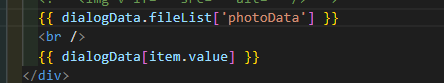

## 日报

已完成：

日期的forma格式化

监管培训的查询等按钮功能（类型在接口上传参要传数据）

改造Dialog

弹窗的图片回显（参照reviewedDetail_DeclarationSubjectInfoBox)

未完成：新增按钮及新增弹窗


目前做到接url数据了，但api入参没明白

 storeId: 'resource'

但提示文件数据不存在


## 我写dialog里面没用

我只有刷新整个页面我的deggger才生效，

应该是这个组件一开始就创建了吧


好像不能在点击时才请求


那问题是fileLink是点击详情请求过来获取的


## 问题




**我老是不会数据回显

可能是看不懂控制台的，可能是分不清对象数组，像上面这两个，我要一个一个试出来，明明是同一个东西，却一个用数组的.方法、一个用对象的

完善按钮功能

## Dialog

把弹窗自己从头到尾敲了

- el-dialog

  - title插槽来自定义，@/assets/images/crowd/declare/change/dialog-icon.png

    放图片，放title

  - 默认插槽写内容

    - 用el-description	column  border  size

      - el-description-item 

        用个for...in（dialogLoading）  里面默认插槽用v-if定义几个格式（大概就两个，文字和图片，这个也写在dialogLoading）

        内容就是{{dialogData}}

  

  传过来的参

   :dialogVisible.sync="dialogVisible"

     :title="title"

     :dialogHeader="dialogHeader"

     :dialogData="basicInfo"


写的标准化时间

 dateFormatter(scope.row[scope.column.property], col.dateType)

```js
  // 将日期转化为标准时间格式
  dateFormatter(time: any, timeFormat: string | true) {
    if (dayjs(time).isValid()) {
      return timeFormat === true ? dayjs(time).format('YYYY-MM-DD') : dayjs(time).format(timeFormat)
    } else {
      return ''
    }
  }
 
```

