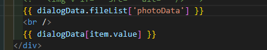

## 日报

已完成：

信用农安的宣传培训：

​	完善细节，对新增和查看详情页面对上传的图片增加文件预览功能，对新增中的上传的图片添加删除按钮并完善图片的删除逻辑，修复上传文件至服务器中再上传到业务数据却没有数据的问题

看js数组、字符串常见方法

:on-preview

:on-remove

用了之后图片上也会有相应事件图标

## 问题

**我老是不会数据回显

可能是看不懂控制台的，可能是分不清对象数组，像上面这两个，我要一个一个试出来，明明是同一个东西，却一个用数组的.方法、一个用对象的

完善按钮功能，（应该是有时候有两种写法是等效的）

## 心路历程

ruleForm

我提交后没有赋空发现也没有影响，是因为按钮是提交的原因吗

点击删除后上传不显示

是因为on-Remove里不能这么玩

  // this.ruleForm.fileList = fileList

没有设flie-list后  删除后上传不会显示

好像是删除之后，因为经过了filelist 没删干净

他们的搜索栏怎么自己有回车，我的也有，所以就没加原生了（加了发现有bug，我明明阻止冒泡了）

之前的不知道为什么file-list不行，点击详情图片都不回显了，更别说预览了，所以又改造了下

文件预览又出问题了，我应该没动哪呀，之前显示出来了的显示不出来了，我直接拿以前的

没写过，我全是小聪明代码，屎山代码乱写