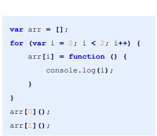

### 日报

农业农村一体化平台

完善了监测对象管理页面，接口联调

搭好了监测对象管理详情页面基本架子

...

学习任务

学习js面向对象部分class、原型、闭包等，学习es6,基础部分--let、const，函数数组对象拓展、新增方法等，js宏微任务，js作用域问题，对预解析和变量提升等有了更深理解，了解了

...
明日计划

学习es6剩余部分，学习axios及其他，阅读[**Lodash 中文文档**](https://www.lodashjs.com/)
......

[(189条消息) 宏任务和微任务的一道经典面试题~_不二博客的博客-CSDN博客](https://blog.csdn.net/qq_39157944/article/details/105157472)

### TODO

浏览器输入url到页面加载全过程

有async和没async

websocket

[一文吃透 WebSocket 原理 刚面试完，趁热赶紧整理 - 掘金 (juejin.cn)](https://juejin.cn/post/7020964728386093093)

editable

[contenteditable - HTML（超文本标记语言） | MDN (mozilla.org)](https://developer.mozilla.org/zh-CN/docs/Web/HTML/Global_attributes/contenteditable)

去重

[(183条消息) JS数组对象使用new Set() 快速去重 - 戴向天_js new set()_戴向天的博客-CSDN博客](https://blog.csdn.net/weixin_41088946/article/details/118915409)

### 学习

#### debugger用法

可以在断点时在控制台里面赋值，debugger之后变量依然存在，方便看数据

如果源代码地方没有显示数据，那就直接去控制台里打印

#### es6

深拷贝为啥    o.msg.age = 20赋值值没变

log 的obj		想证明两个已经不是同一份了

var let 经典面试题

方法的作用域是单独的，等循环结束才执行？

**预解析**是在程序执行之前，会进行一遍预检。查找当前**作用域**内由 `function` 和 `var` 。并且每次更换作用域都会在此作用域中执行**预解析**

**变量提升**是指，在查找到由 `function` 和 `var` 后，首先在当前作用域的顶端定义好并赋给默认值。`var`的默认值为 `undefined`， `function`的默认值为**函数本身**

预解析和变量提升的过程中，并不会将变量赋值，而只是定义

方法优先级比var高

宏任务和微任务和循环里的方法调用顺序有什么关联吗（let面试题）

并没有，就只是变量提升

代码意思：循环给arr赋值，在循环结束后调用让他们去找i

换成let 每个都是不同的，都有自己的块级作用域

var时，函数执行时循环已经结束了，所以i都是2，方法向上查找作用域，上级是全局左右域，

而let时，方法向上查找作用域，找到的是循环产生的块级作用域，

[彻底弄懂JavaScript作用域问题 - 知乎 (zhihu.com)](https://zhuanlan.zhihu.com/p/161398465)

