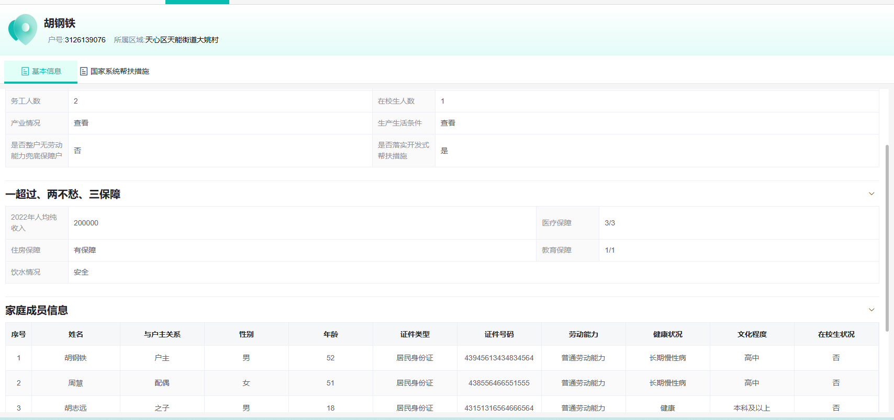
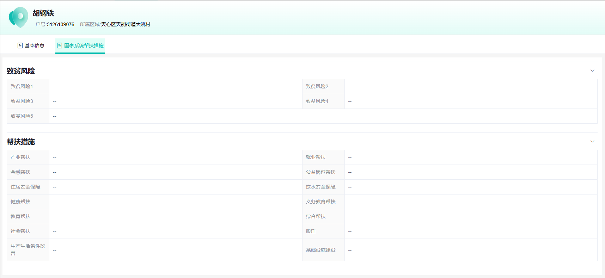

### 日报

农业农村一体化平台

写好监测对象管理详情两个页面，接口联调

阅读[**Lodash 中文文档**](https://www.lodashjs.com/)

...
未完成计划

学习es6剩余部分，学习axios及其他，阅读[**Lodash 中文文档**](https://www.lodashjs.com/)
......

明日计划

将两个详情页面的细节完善好，学习es6剩余部分，学习axios及其他
......

基本信息组件 参考managementDetail  

的写studentInfo组件结构

写在了component里

 cursor: pointer;

设置光标类型

### 问题：

找不到接口位置，常常出现要猜这个接口是干嘛的

     
