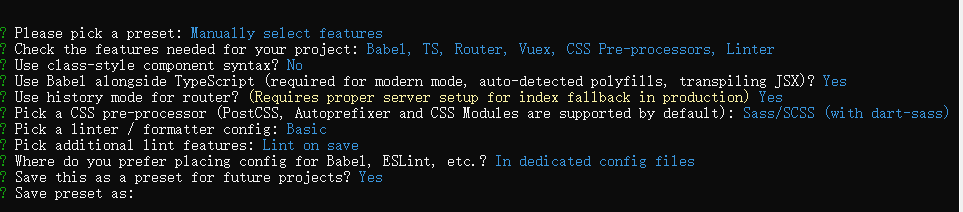

问有没有接口文档--没有

### 日报

农业农村一体化平台

git提交监测对象管理详情两个页面，为文件上传页面开了路，简单捋了下部分逻辑

练习整理了git一些指令

阅读了Lodash库中数组对象一些常见方法--看的比较少，防抖节流还没看，

学习es6迭代器、生成器部分（花的时间有点久）

重温了部分vue-router的传参和守卫等内容（感觉没有进步，唤醒记忆，没啥领悟）

...
未完成计划

学习es6剩余部分，学习axios、vuex等
......

明日计划

学习es6剩余部分，学习axios及其他，捋文件上传页面为下个星期做准备
......


源代码管理，中

+号  代表是git add   


可以选择文件放弃更改

feat(fuwu): 监测对象管理及详情开发，接口联调

feat 代表新增，括号内是模块名字，英文冒号后是  备注（八字以上）

最后点提交 代表是git commit

commit后在desktop就能看到了


### 创建vue3 项目




### 文件上传


2部分是在upload的.then中，.then中调用的是handleSuccess方法，先放到变量里在点击页面的发布时，上传到业务数据库中，就是3的部分

[智慧农业农村云上资料库](http://10.14.3.27:4933/sub/subSystem-cloud/keyWork/list?menuId=12941)


:on-success="handleSuccess"

on-success	文件上传成功时的钩子

把linkGuid文件名等信息，给到业务系统数据库中保存

```
  handleSuccess (res: any) {
    const { fileName, linkGuid } = res
    console.log(JSON.stringify(this.form.files, null, 2))
    const hasUploaded = this.form.files.find((item: any) => item.fileLinkId === linkGuid)
    console.log(linkGuid, fileName)
    if (!hasUploaded) {
      this.form.files.push({
        fileLinkId: linkGuid,
        fileName,
        name: fileName
      })
    }
  }
```


### 插件

GitLens — Git supercharged

Git History


### git

 git pull origin dev

git stash list 


git stash  

git stash pop  

git stash clear  


### el-upload

​    :http-request="handleUpload"

覆盖默认的上传行为，可以自定义上传的实现


multiple  是否支持多选文件   boolean	


### vue-router

 // 动态字段以冒号开始  { path: '/users/:id', component: User },


*路径参数* 用冒号 `:` 表示。当一个路由被匹配时，它的 *params* 的值将在每个组件中以 `this.$route.params` 的形式暴露出来。因此，我们可以通过更新 `User` 的模板来呈现当前的用户 ID：

js

```
const User = {
  template: '<div>User {{ $route.params.id }}</div>',
}
```

### lodash

看了些es6不容易实现的东西，找了些博客看，没有看官方文档，浅看了看示例的程度，项目中要用还很难想到用lodash里的方法

[都听说过 lodash，但你会用吗？ - 掘金 (juejin.cn)](https://juejin.cn/post/7143579596217122853)

[Lodash 前端必备神器：学会这些技巧，让你代码量减半、效率翻倍！ - 掘金 (juejin.cn)](https://juejin.cn/post/7241171237601902647#heading-1)

deepclone

#### 1. debounce

`_.debounce(func, [wait=0], [options={}])` 防抖函数可以延迟执行一个函数，并且只有当延迟时间过去后该函数没有被再次调用时才会执行。其中，参数 `func` 是要延迟执行的目标函数；`wait` 是延迟的毫秒数，默认为 0；`options` 是一个可选的配置对象，可以用来额外控制防抖的行为。

```javascript
javascript复制代码// 例如，下面是一个带有搜索框的页面，并且需要在用户停止输入 500 毫秒后才开始搜索：
function search(keyword) {
  // 根据关键词进行搜索
  console.log(`Searching for '${keyword}'...`)
}

const inputEl = document.getElementById('search-input');

// 创建 debounce 函数，最多每 500 毫秒执行一次 search 函数
const debouncedSearch = _.debounce(search, 500);

// 监听 input 变化，如果有变化则调用 debouncedSearch 函数
// 每当出现输入变化时，我们会将输入内容传递给 `debouncedSearch` 函数，这个函数会将搜索操作延迟 500 毫秒后执行。因此，只有用户停止输入 500 毫秒之后，才会真正执行搜索操作
inputEl.addEventListener('input', (evt) => {
  const keyword = evt.target.value.trim();
  debouncedSearch(keyword);
});
```

#### 2. throttle

`_.throttle(func, [wait=0], [options={}])` 节流函数可以限制一个函数在一定时间范围内最多执行一次。也就是说，如果同一个函数在短时间内多次触发，这个函数只会以固定的频率执行。

```javascript
javascript复制代码// 例如，下面是一个点击按钮时每隔 1 秒输出一次 log 的示例：
function log() {
  console.log('Clicked!');
}

const btnEl = document.getElementById('click-button');

// 创建 throttle 函数，最多每 1 秒执行一次 log 函数
const throttledLog = _.throttle(log, 1000);

// 监听 click 事件，如果有点击则调用 throttledLog 函数
// 每当用户点击按钮时，我们会调用 `throttledLog` 函数，这个函数会通过限制函数的执行频率，保证每隔 1 秒钟输出一条日志。即使用户连续点击按钮，也只有第一次点击可以触发函数的执行，后续的点击都会被忽略
btnEl.addEventListener('click', (evt) => {
  throttledLog();
});
```

#### 3.  delay

`_.delay(func, [wait], [args])` 函数可以延迟执行一个函数，并指定延迟的时间和参数。

```javascript
javascript复制代码function log(name) {
  console.log(`Hello, ${name}`);
}
_.delay(log, 2000, 'Tom'); // 两秒后输出：'Hello, Tom'
```


作者：Cosolar
链接：https://juejin.cn/post/7241171237601902647
来源：稀土掘金
著作权归作者所有。商业转载请联系作者获得授权，非商业转载请注明出处。


### 问题：

描述列表的span到底怎么生效，项目里一直没有生效


