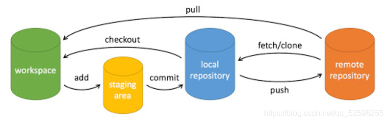

[Learn Git Branching](https://learngitbranching.js.org/?locale=zh_CN)

观看原因，这样网站能动手实操，看视频有点感觉脱离实际，没看到啥东西、印象不深刻，真正要用的时候还是不会用（大概停留在只知道有这个命令）；

git命令现在只会跟着荣哥演示的命令来，我想更进一步，起码下次碰到另一个命令的时候能反应过来更多的东西


#### 目标：

弄清楚每个git 命令后面的参数

汇总整理成 我的git命令列表清单


命令后的origin 参数 代表远程仓库

git push <remote> <place>

```
git push origin main
```

把这个命令翻译过来就是：

*切到本地仓库中的“main”分支，获取所有的提交，再到远程仓库“origin”中找到“main”分支，将远程仓库中没有的提交记录都添加上去，搞定之后告诉我。*

我们通过“place”参数来告诉 Git 提交记录来自于 main, 要推送到远程仓库中的 main。它实际就是要同步的两个仓库的位置。


要同时为源和目的地指定 `<place>` 的话，只需要用冒号 `:` 将二者连起来就可以了

1. `<remote>`：远程仓库的名称。它指定了你要将代码推送到哪个远程仓库。例如，`origin` 是默认的远程仓库名称。
2. `<branch>`：分支的名称。它指定了你要推送哪个分支的代码。例如，`master` 是默认的主分支名称。
3. `--all`：推送所有分支到远程仓库。使用这个参数可以将本地所有分支都推送到远程仓库。
4. `--tags`：推送所有标签到远程仓库。使用这个参数可以将本地所有标签都推送到远程仓库。
5. `--force`：强制推送。使用这个参数可以强制将代码推送到远程仓库，即使有冲突或者会覆盖已有的提交。
6. `--set-upstream` 或 `-u`：设置上游分支。使用这个参数可以将当前分支与远程分支关联起来，以后可以直接使用 `git push` 推送代码。
7. `<refspec>`：自定义引用规范。它可以指定要推送的分支或标签的引用规范。例如，`refs/heads/feature`


git checkout 

git merge （要合并到）   合并

`git pull` 就是 fetch 和 merge 的简写

`git pull --rebase` 就是 fetch 和 rebase 的简写！

git rebase （x分支）   合并分支的方法--把当前分支复制到x分支上。

Rebase 实际上就是取出一系列的提交记录，“复制”它们，然后在另外一个地方逐个的放下去。**拉公共分支最新代码**

git pull -r或git pull --rebase

（好像只有个人开发用？）

