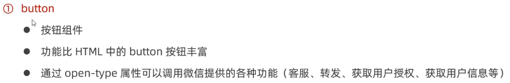
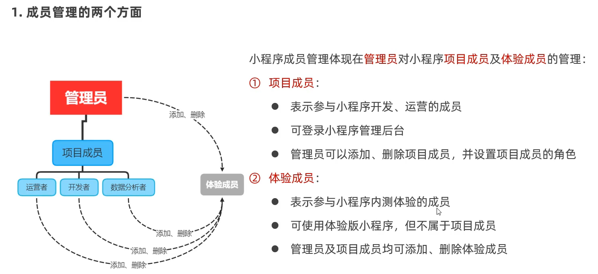
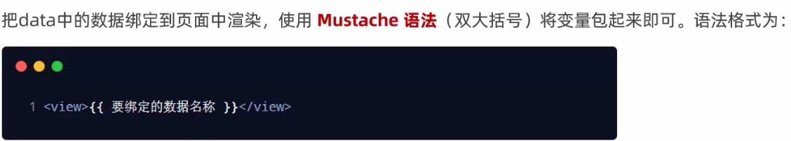
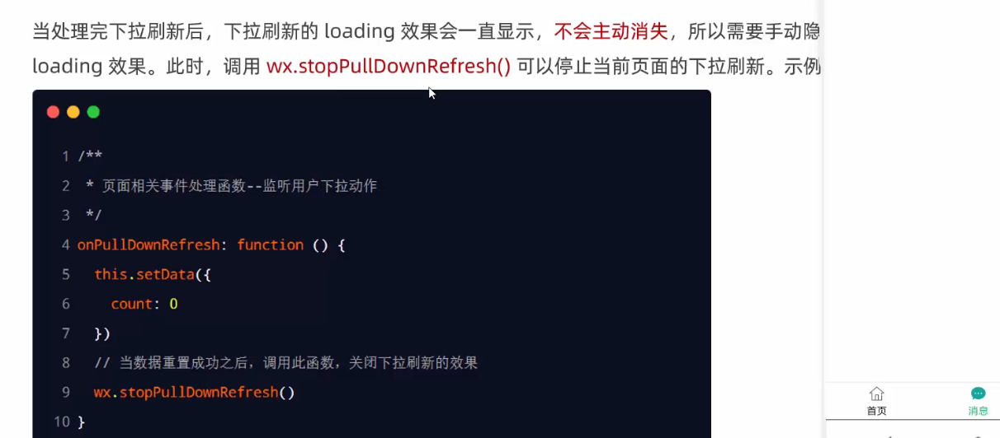
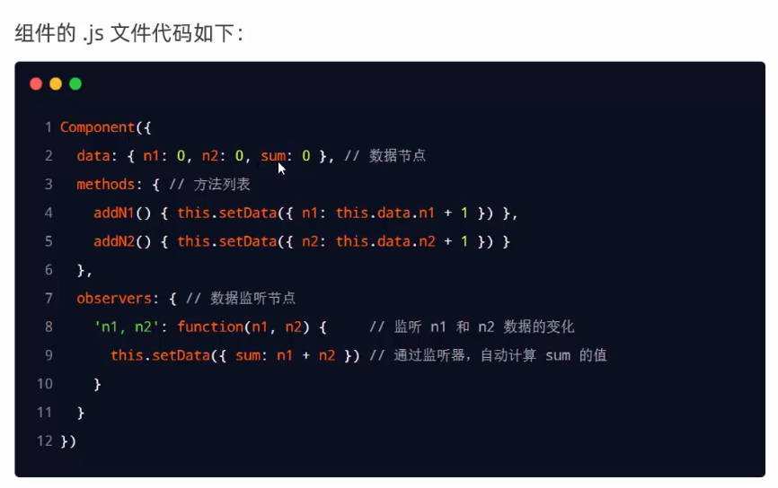

# 周报

速通vue3部分，速通小程序知识点

完成旆哥布置的页面，

农业农村 -> 行政 -> 会议管理 -> 会议申请，看完了该页面的部分逻辑，先切图，下个星期做逻辑

## 任务：

用二维码扫出这个页面来，在网上找一个截取url的id的逻辑方法，

这里写样式，所有的数据都是通过接口（传url）过来的，把数据绑上去


农业农村 -> 行政 -> 会议管理 -> 会议申请


会议地点的下拉栏的各个配置项处理


看看纪要上传人怎么处理数据给级联的

好像不是从接口来的，从vuex来的


请求写的和以前的好不一样，初始化数据在想怎么下手


事已至此，先切图吧


通知人员

样式加伪类

​	  &:hover {

​     padding: 2px 8px;

​     background: #f5f5f5;

​     border: 1px solid #d9d9d9;

​     border-radius: 4px;

​     margin: 0 4px 0 0;


​     \> i {

​      display: inline-block;

​     }


​     \> span {

​      display: none;

​     }

​    }


# Vue3

[[Vue\]Vue3学习笔记(尚硅谷)_vue3尚硅谷笔记_萤火虫的小尾巴的博客-CSDN博客](https://blog.csdn.net/m0_53022813/article/details/128527334?ops_request_misc=%7B%22request%5Fid%22%3A%22169199762716800185884007%22%2C%22scm%22%3A%2220140713.130102334..%22%7D&request_id=169199762716800185884007&biz_id=0&utm_medium=distribute.pc_search_result.none-task-blog-2~all~sobaiduend~default-2-128527334-null-null.142^v92^control&utm_term=Vue3尚硅谷&spm=1018.2226.3001.4187)

### 项目结构

对比


可以没有根标签了


### 路由变化

useRouter()

useRoute()

### reactive函数

ref处理对象类型时，会求助reative  （此次对象的.value就是proxy、reavtive创建的吧？--应该没错了`ref(X)` 就是 `reactive({ value: X })`）


整个都变成响应式了，深层次的


原理和ref不一样

- ref通过`Object.defineProperty()`的`get`与`set`来实现响应式（数据劫持）。
- reactive通过使用**Proxy**来实现响应式（数据劫持）, 并通过**Reflect**操作**源对象**内部的数据

代理后，可以对数组可以直接赋值了

比起ref，不用写value了


一般来说，都把组件用到的数据都封装到一个对象里，所以reactive常用

### vue2响应式

使用Object.defineProperty()的get（）、set（）对读取、修改进行数据劫持

无法新增、删除，

**解决方法**：只能使用this.$set、$delete，

直接通过下标修改数组，页面不更新

**解决方法:**this.$set(数组，index，value)，用数组方法


### vue3响应式

target ：源对象

通过Proxy（代理）: 拦截对象中任意属性的变化, 包括：属性值的读写、属性的添加、属性的删除等。但没有像我们那么low，直接在proxy里直接修改数据而是，

通过Reflect（反射）: 对源对象的属性进行操作。


Object.defineProperty重复修改同一个属性会报错（只能通过try...catch；了），而Reflect.defineProperty会通过返回布尔值提醒--代码健壮性


完整步骤：

```
//模拟Vue3中实现响应式
//#region 
const p = new Proxy(person,{
	//有人读取p的某个属性时调用
	get(target,propName){
		console.log(`有人读取了p身上的${propName}属性`)
		return Reflect.get(target,propName)
	},
	//有人修改p的某个属性、或给p追加某个属性时调用
	set(target,propName,value){
		console.log(`有人修改了p身上的${propName}属性，我要去更新界面了！`)
		Reflect.set(target,propName,value)
	},
	//有人删除p的某个属性时调用
	deleteProperty(target,propName){
		console.log(`有人删除了p身上的${propName}属性，我要去更新界面了！`)
		return Reflect.deleteProperty(target,propName)
	}
})
//#endregion


```


### set up函数注意点

#### 执行时机


#### 两个传入值：props、context

props且是proxy（是不是说明和vue2只能用不能修改不一样了？）

有东西传入但没用prop接收会警告    那$attr还会生效吗


context里有attr、emit、slot、


emits:['hello'], *// 绑定的自定义事件在组件中需要使用emits配置项接收*


### watch

从配置项变成函数了（去看看注解@watch）


监测的是结构，第一个参数怎么都不加value

三个参数


reatvie没 oldvalue、deep了	（ref还是都能用）

如果真的需要oldvalue，把数据拎出去用ref处理


当监测的是reative定义的对象的某个属性，

第一个参数写成函数回调：()=>person.job

deep有效（不过只有对象属性才配用）


### 生命周期

销毁名字变成卸载了

v-if 里面写组件```<Demo v-if="isShowDemo"/>``` 不生效的时候就被卸载

对组合api的理解：钩子函数也能从配置项变成组合api，可以放入组合api的大舞台--setup（）				更加的高内聚，低耦合

但每一个都得改名


使用：先import引入


### 自定义hook函数

数据、方法、生命周期（把setup中使用的组合api进行封装）

完全放到一个函数里


像个工具包，说和mixin很像（去看看mixin）


### toRef和toRefs

不丢响应式的传出去

toRef  像$set一样的用法样的

*const name2 = toRef(person,'name')*


toRefs还是浅的，只把一层都变成了proxy


### 其他组合api

#### shallowRef

不求人的ref

#### shallowReactive 

只处理对象最外层属性的响应式（浅响应式）


- 如果有一个对象数据，后续功能不会修改该对象中的属性，而是生成新的对象来替换，即对于该对象数据在后续功能中不会修改其属性，而是会将该对象整个进行替换 ===> shallowRef。

  

  使它能够查看到、但不能修改无效，但是又要当它整个被替换时能被监测到


#### readonly 和shallowReadonly 

接收一个响应式数据为参数。

readonly 深只读

shallowReadonly 马奇诺只读


### toRaw 与 markRaw

- toRaw 接收一个响应式对象为参数，只能接收reactive生成的响应式对象，不能处理ref生成的响应式数据
- 作用：将一个由`reactive`生成的**响应式对象**转为**普通对象**。


那我直接等于赋值效果不是一样吗？

直接深拷贝不就行了？还要这个干嘛？（应该是深拷贝对proxy对象有什么限制吧？）

弹幕说提交表单的时候要用


markRaw：
接收一个对象类型数据为参数
作用：标记一个对象，使其永远不会再成为响应式对象。向一个已经是响应式对象的数据追加一个属性，该属性的值为对象类型数据，vue会为其自动添加响应式，当不希望该属性的值为响应式时可以使用该函数，减小开销。
应用场景:
有些值不应被设置为响应式的，例如复杂的第三方类库等，如果向响应式对象追加一个第三方类库对象(一般属性多且层次多)，开销会很大。
当渲染具有不可变数据源的大列表时，跳过响应式转换可以提高性能。


### customRef

毛坯房ref，手动挡ref

没看懂track,trigger操作，去找点东西看

### provide 与 inject

provide 与 inject

### 响应式数据的判断

isRef: 检查一个值是否为一个 ref 对象
isReactive: 检查一个对象是否是由 reactive 创建的响应式代理
isReadonly: 检查一个对象是否是由 readonly 创建的只读代理
isProxy: 检查一个对象是否是由 reactive 或者 readonly 方法创建的代理


### Teleport

Teleport

将我们的**组件html结构**移动到指定位置

加个遮罩，to='body',实现弹窗


# 小程序


## 宿主环境-组件

### 视图容器


#### **view使用**  

普通div，照样用css的东西（标签里用.class,选择器）


#### 使用scroll-view  标签

1.标签加纵向滚向属性，

2.纵向滚动的话，就给这个容器固定高度


****

#### 轮播图容器


1.


---


---

小圆点的激活颜色和未激活颜色


### 基础内容

#### 常用的


##### 使用:


---


#### 其他



type:主色调

size

plain:没有背景色,但有边框线


样式版本,去掉它页面样式会有很大变化


---


##### image


###### 使用:


---

###### 属性:


aspectFit:副作用,会有留白


---


### 表单最优解


### 导航组件


媒体组件


## 宿主环境-api


没理解同步api的执行结果,可以通过函数返回值直接获取是什么意思


## 协同工作和发布

### 小程序成员管理




添加项目成员和体验成员


### 发布

#### 上传


审核完就可以点击发布上线了


#### 推广

两个码都可以


设置->基本设置

名称、码etc...


#### 运营数据

后台的统计


看前思考：

​	WXML

​	wxss是啥，不是直接用css吗

.json的使用

网络请求

## WXML模块语法

### 数据绑定

#### **在data中定义数据**

和vue一样，data是个大对象


#### 在WXML中使用数据

Mustache语法（插值语法）



##### 应用场景

 **动态绑定内容**

如上

**动态绑定属性**

和vue的需要用v-bind指令不一样，也和内容一样直接用就行


**计算：**

**三元运算符**

 

**算数运算**


### 事件绑定

把渲染层产生的变化传到逻辑层


#### 常用事件


### **bindtap**及事件的一些基本东西


---

打印的这个 e 里面的属性就是下面的


---

event.traget


#### 事件处理函数中给data的数据赋值

划重点：通过什么方法修改的；新值和旧值是怎么表达的


#### 事件传参（和vue不一样）

什么东西都放在e里


---

**放：**

data-


传参可以传data的数据吗，那怎么区分string和变量的？

不加{{}}，就是字符串的2，传数字用{{}}

**拿：**


**使用：**


### bindinput


#### 文本框和data数据的同步


### 条件渲染


### blok

只起包裹作用


也可以用hidden直接控制标签显示和隐藏（就是更改display。有vue那味了欧，视频也有对比）


### 列表渲染 wx:for

默认自带index和item


**手动指定**


---


**wx:key**

这个key也能像vue一样，是这么用吗，wx:key = "{{index}}"（要不要加引号）


## WXSS模块样式

WXSs(WeiXin Style Sheets)是一套样式语言，用于美化 WXML的组件样式，类似于网页开发中的 CSS.


WXSS 具有 CSS 大部分特性，同时，WXSS 还对 CSS 进行了扩充以及修改，以适应微信小程序的开发与CSS相比，wXS 扩展的特性有:
rpx 尺寸单位
@import 样式导入


不能用rem了，就用rpx


#### rpx尺寸单位

rpx (responsive pixel) 是微信小程序独有的，用来解决屏适配的尺寸单位


**rpx的实现原理**
rpx 的实现原理非常简单:鉴于不同设备屏幕的大小不同，为了实现屏幕的自动适配，rpx 把所有设备的屏幕在宽度上等分为 750 份 (即: 当前屏幕的总宽度为 750rpx)。

---


官方建议: 开发微信小程序时，设计师可以用 iphone6 作为视觉稿的标准

开发举例:在iPhone6上如果要绘制宽100px，高20px的盒子，换算成rpx单位，宽高分别为 200rpx和 40rpx.


#### 样式导入 @import

**语法格式**
@import 后跟需要导入的外联样式表的相对路径，用;表示语句结束。示例如下


全局样式和局部样式

app.wxss


## json的那个配置

### 全局app.json

小程序根目录下的 app.json 文件是小程序的全局配置文件。常用的配置项如下

**window**
全局设置小程序窗口的外观

pages
记录当前小程序所有页面的存放路径

**tabBar**
设置小程序底部的 tabBar 效果
style
是否启用新版的组件样式


#### 小程序窗口的组成部分


window就是前两个个 主要就是做导航栏区域的

## window

### 常用配置项


标题颜色（navigationBarTextStyle）只能设置black和white


下拉刷新开启，就能看到背景了，真机上下拉刷新后并不会合上，还要进行相应处理

#### 设置导航栏标题

设置步骤: app.json -> window -> navigationBarTitleText

需求:把导航条上的标题，从默认的“WeChat”修改为“黑马程序员”效果如图所示:


## tarbar

### 什么是 tabBar

tabBar 是移动端应用常见的页面效果，用于实现多页面的快速切换。小程序中通常将其分为底部 tabBar

顶部 tabBar
注意:
tabBar中只能配置最少 2个、最多 5个 tab 页签当渲染顶部 tabBar 时，不显示 icon，只显示文本


### 6个组成部分

backgroundColor: tabBar 的背景色
selectedIconPath: 选中时的图片路径
borderStyle: tabBar 上边框的颜色
iconPath: 未选中时的图片路径
selectedColor: tab 上的文字选中时的颜色
color: tab 上文字的默认 (未选中)颜色


### tarbar节点配置项

和写window一样


在里面写配置项


#### 每个tab 项的配置选项


### 案列：配置tarbar

写pages（tarbar需要写在最前面部分），然后和pages、window节点平级，新增tarbar节点


1

打开 appjson 配置文件，和 pages、window 平级，新增 tabBar 节点

2

tabBar 节点中，新增 list 数组，这个数组中存放的，是每个 tab 项的配置对象3在list 数组中，新增每一个 tab 项的配置对象。对象中包含的属性如下:
3
pagePath 指定当前 tab 对应的页面路径[必填]
text 指定当前 tab 上按的文字[必填]
iconPath 指定当前 tab 未选中时候的图片路径[可选]
selectedIconPath 指定当前 tab 被选中后高亮的图片路径(可选]


pagePath就是上面pages里的


## page

通过 app.json 文件的 pages 节点，快速新建3个对应的tab 页面，示例代码如下:

写了之后会在pages文件夹中创建对应文件名


## 小程序的页面配置	页面page.json

#### 页面配置的常用配置项

和window一模一样


## 网络数据请求

### 限制


### 配置request 合法域名

需求描述:假设在自己的微信小程序中，希望请求 https://www.escook.cn/ 域名下的接口配置步骤: 登录微信小程序管理后台 -> 开发 -> 开发设置 -> 服务器域名 -> 修改 request 合法域名


注意事项
域名只支持https 协议
域名不能使用IP地址或localhost
域名必须经过ICP备案
服务器域名一个月内最多可申请5次修改


### 发起GET请求


发起POST请求


### 页面刚加载时请求数据

5.在页面刚加载时请求数据
在很多情况下，我们需要在页面刚加载的时候，自动请求一些初始化的数据。此时需要在页面的 onLoad 事件中调用获取数据的函数，示例代码如下:

写在.js里，加this


### 跳过request合法域名校验

如果后端程序员仅仅提供了 http 协议的接口、暂时没有提供 https
协议的接口。
此时为了不耽误开发的进度，我们可以在微信开发者工具中，临时开启开发环境不校验请求域名、TLS 版本及 HTTPS 证书，选项跳过 request 合法域名的校验。
注意:
跳过 request 合法域名校验的选项，仅限在开发与调试阶段使用!


### 跨域和Ajax的说明

跨域问题只存在于基于浏览器的 Web 开发中。由于小程序的宿主环境不是浏览器，而是微信客户端，所以小程序中不存在跨域的问题。


Ajax 技术的核心是依赖于浏览器中的 XMLHttpRequest 这个对象，由于小程序的宿主环境是微信客户端，所以小程序中不能叫做“发起 Ajax 请求”，而是叫做“发起网络数据请求”


## day3

## 生成式页面导航


#### 导航到tarbar页面和非

  tabBar 页面指的是被配置为 tabBar 的页面
在使用**<navigator> **组件跳转到指定的 tabBar 页面时，需要指定 url属性和 open-type 属性，其中url 表示要跳转的页面的地址，必须以/开头
open-type 表示跳转的方式，必须为 switchTab


跳转到非tabbar

跳转方式为navigate（可省略不写）

### 后退导航

如果要后退到上一页面或多级页面，则需要指定 open-type 属性和 delta 属性，其中open-type 的值必须是 navigateBack，表示要进行后退导航delta 的值必须是数字，表示要后退的层级


注意:为了简便，如果只是后退到上一页面，则可以省略 delta 属性，因为其默认值就是1


### 传参

和网页一致

navigator组件的url属性用来指定将要跳转到的页面的路径。同时，路径的后面还可以携带参数
参数与路径之间使用?分隔
参数键与参数值用=相连
不同参数用 & 分隔

## 编程式导航

### 导航到 tabBar 页面和非

调用 **wx.switchTab(0bject object)**方法，可以跳转到 tabBar 页面。其中 0bject 参数对象的属性列表如下:


调用 wx.navigateTo(0bject object)方法，可以跳转到非 tabBar 的页面。其中 Object 参数对象的属性列表和tabBar一样

url中同样和网页一样可以携带参数，规则一样


### 后退导航

调用 wx.navigateBack(bject object)方法，可以返回上一页面或多级页面。其中 Object 参数对象可选的属性列表一致，没有url只要delta，默认为1


## 导航传参

3在onLoad 中接收导航参数

通过声明式导航传参或编程式导航传参所携带的参数，可以直接在 onLoad 事件中直接获取到，示例代码如下:
1 /*
2 * 生命周期函数--监听页面加载
3*/
4 onLoad: function(options) {
5// **options 就是导航传递过来的参数对象**  填坑了
6console.log(options)


## 页面事件

### 下拉刷新事件

启用：

全局开启下拉刷新
在app.json 的 window 节点中，将enablePullDownRefresh 设置为 true局部开启下拉刷新
在页面的 json 配置文件中，将 enablePullDownRefresh 设置为 true


#### 监听页面的下拉刷新事件

在页面的 js 文件中，通过 **onPullDownRefresh()** 函数即可监听当前页面的下拉刷新事件。


#### 停止下拉刷新的效果



### 上拉触底事件

#### 监听页面的上拉触底事件


在页面的.js 文件中，通过 onReachBottom() 函数即可监听当前页面的上拉触底事件。示例代码如下


#### 填坑：

配置上拉触底距离
上拉触底距离指的是触发上拉触底事件时，滚动条距离页面底部的距离可以在全局或页面的 json 配置文件中，通过 onReachBottomDistance 属性来配置上拉触底的距离。小程序默认的触底距离是 50px，在实际开发中，可以根据自己的需求修改这个默认值。


## loading提示框

 wx.showLoading({})

不会自己关闭，要用hiddenLoding自己关闭


所以success和complete都不是关键字函数是吗？  --不是，都是request自己有的

success作用：
success 是请求成功后的回调函数，接收一个参数 res，包含了成功请求后返回的数据。

fail作用：
fail 是请求失败后的回调函数，接收一个参数 err，包含了失败信息。

complete作用：
complete 是请求完成后的回调函数，无论成功失败都会调用。

原文链接：https://blog.csdn.net/HK52021/article/details/130652222


### 自定义编译模式

每次刷新都跳到你自己规定的页面


## **生命周期**

#### 应用的


后台概念引导：按home键，小程序就进入后台了

#### 页面的


onLoad 已经是熟人了，和之前的串起来了，怎么请求数据的方法就是放在这里的


看官网，可以修改页面标题啥的（修改页面配置）


应用：


## WXS脚本

wXS (WeiXin Script)是小程序独有的一套脚本语言，结合 WXML，可以构建出页面的结构.


wxml中无法调用在页面的.js 中定义的函数，但是，**wxml中**可以调用 wXs 中定义的函数。因此，小程序中wxs 的典型应用场景就是“过滤器


不是能调用吗，上面不是有调用.js的情况吗


那还有.js 的文件 干嘛，怎么不全写进去   --说在ios比js快2~20倍


还是说那边就是叫事件处理函数，这里是指在插值语法写的函数		--对的

典型场景就是过滤器，搭配插值语法使用，不能在事件回调函数使用


让我想起了之前项目里处理的那个后端传过来是id，但显示肯定是name，然后又要传id

受限于vue的v-model你只能v-model =  name，导致还要写逻辑转了两圈，有了这个的话就好办了	--v-model绑id，@change赋name，看要求，看着也行


说这是.js做不到的


[小程序中的WXS脚本 - 掘金 (juejin.cn)](https://juejin.cn/post/7059390742812164110)

m1在.js里data定义


## Day3案列

下拉刷新里这么玩的，在getList函数传cb回调函数


这样来区分执不执行关闭下拉刷新（按需执行取消下拉回调）


## Day4


## 使用NPM包

### Vant weapp

#### 安装

在小程序项目中，安装Vant 组件库主要分为如下3步通过 npm 安装(建议指定版本为@1.3.3
构建npm包
修改appjson

看vant官网


右键终端打开


菜单栏的工具->构建


把 style :'v2'删掉

#### 使用

安装完Vant 组件库之后，可以在 app,json 的 usingComponents 节点中引入需要的组件，即可在 wxml中直接使用组件。示例代码如下:


## 自定义组件


使用自己写的myTest组件


#### 组件样式隔离

app.wxss中的全局样式对组件无效
只有 class 选择器会有样式隔离效果，id 选择器、属性选择器、标签选择器不受样式隔离的影响


**--讲的有问题吧？app.wxss中的全局样式对组件无效？**


组件的叫Component的


### data和methods

数据放data

事件处理函数和自定义方法需要定义到 methods 节点中

_开头的为自定义处理方法


### properties


### 数据监听器


#### 基本用法




### 纯数据字段

#### 什么是纯数据字段

概念:纯数据字段指的是那些不用于界面渲染的 data 字段
应用场景: 例如有些情况下，某些 data 中的字段既不会展示在界面上，也不会传递给其他组件，仅仅在当前组件内部使用。带有这种特性的 data 字段适合被设置为纯数据字段。
好处:纯数据字段有助于提升页面更新的性能


在Component 构造器的 options 节点中，指定 pureDataPattern 为一个正则表达式，字段名符合这个正则表达式的字段将成为纯数据字段，示例代码如下:


### 组件生命周期


#### created

组件实例刚被创建好的时候，created 生命周期函数会被触发
**此时还不能调用 setData**
通常在这个生命周期函数中，只应该用于**给组件的 this 添加一些自定义的属性字段**

#### attached（用的最多）

在组件完全初始化完毕、进入页面节点树后，attached 生命周期函数会被触发
此时，**this.data 已被初始化完毕**
这个生命周期很有用，绝大多数初始化的工作可以在这个时机进行(例如发请求获取初始数据)在组件离开页面节点树后，

####  detached 

 detached 生命周期函数会被触发
退出一个页面时，会触发页面内每个自定义组件的 detached 生命周期函数
此时适合做一些清理性质的工作


### lifetimes 节点（定义生命周期的节点）

在小程序组件中，生命周期函数可以直接定义在 Component 构造器的第一级参数中（和data和methods平级），可以在 lifetimes 字段内进行声明(这是推荐的方式，其优先级最高【比旧的高】)。示例代码如下:


### 组件所在页面的生命周期

有时，自定义组件的行为依赖于页面状态的变化，此时就需要用到组件所在页面的生命周期


在组件中.js 中可以监听所在页面的生命周期函数


有时，自定义组件的行为依赖于页面状态的变化，此时就需要用到组件所在页面的生命周期例如:每当触发页面的 show 生命周期函数的时候，我们希望能够重新生成一个随机的 RGB 颜色值在自定义组件中，组件所在页面的生命周期函数有如下3个，分别是:


#### pageLifetimes


案列：在show中调用随机生成函数，随机生成rgb			--这我不是也可以放在attached里吗？


### 插槽

启用多个插槽          


定义多个插槽

可以在组件的.wxml中使用多个 <slot> 标签，以不同的 name 来区分不同的插槽。示例代码如下


### 父子组件间的通信

#### 属性绑定

用于组件向子组件的指定属性设置数据，**仅能设置JSON兼容的数据**


#### 事件绑定

用于子组件向父组件传递数据，可以传递**任意数据**获取组件实例

事件绑定用于实现子向父传值，可以传递任何类型的数据。使用步骤如下:
在父组件的js 中，定义一个函数，这个函数即将通过自定义事件的形式，传递给子组件1在父组件的 wxml中，通过自定义事件的形式，将步骤1 中定义的函数引用，传递给子组件@在子组件的 js 中，通过调用 this.triggerEvent(自定义事件名称，/* 参数对象/)，将数据发送到父组件在父组件的js 中，通过e.detail 获取到子组件传递过来的数据


#### this.selectComponent()

父组件还可以通过 this.selectComponent()获取子组件实例对象这样就可以直接访问子组件的任意数据和方法

this.$ref的感觉？


可在父组件里调用 this.selectComponent("id或class选择器")，获取子组件的实例对象，从而直接访问子组件的任意数据和方法。调用时需要传入一个选择器，例如 this.selectComponent(",my-component")。


### behaviors

1.什么是behaviors
behaviors 是小程序中，用于实现组件间代码共享的特性，类似于 Vue.js 中的“mixins”

引入behaviors构造器

2.behaviors的工作方式
每个behavior 可以包含一组属性、数据、生命周期函数和方法。组件引用它时，它的属性、数据和方法会被合并到组件中


优先级，自己看官网

字符串组件优先

对象合并


## D5

创建、引入组件


页面的事件只需要定义在.js中（与data、生命周期平级），而组件的必须在methods节点中


安装npm包后删除那个mini的包，再点工具栏的构建npm


## 小程序的api的Promise化


之前的请求是这样的，现在用了个包

能这么玩了，


## MobX全局数据共享

2.小程序中的全局数据共享方案
在小程序中，可使用 mobx-miniprogram 配合 mobx-miniprogram-bindings 实现全局数据共享。其中:mobx-miniprogram 用来创建 Store 实例对象mobx-miniprogram-bindings 用来把 Store 中的共享数据或方法，绑定到组件或页面中使用


注意: MobX 相关的包安装完毕之后，记得删除 miniprogram_npm 目录后，重新构建 npm。


创建


使用


将这些东西绑到this上

fields，绑定字段

actions绑定方法

this.storeBindings 竟然不需要声明


仔细看图体会


## 分包

4.分包后项目的构成
分包后，小程序项目由 1 个主包 + 多个分包组成
主包:一般只包含项目的启动页面或 TabBar 页面、以及所有分包都需要用到的一些公共资源分包:只包含和当前分包有关的页面和私有资源


5.分包的加载规则
在小程序启动时，默认会下载主包并启动主包内页面
tabBar 页面需要放到主包中
当用户进入分包内某个页面时，客户端会把对应分包下载下来，下载完成后再进行展示非 tabBar 页面可以按照功能的不同，划分为不同的分包之后，进行按需下载


6.分包的体积限制
目前，小程序分包的大小有以下两个限制:整个小程序所有分包大小不超过 16M (主包 +所有分包)单个分包/主包大小不能超过 2M


### 引用分包


### 分包- 使用分包

3.引用原则
主包无法引用分包内的私有资源分包之间不能相互引用私有资源分包可以引用主包内的公共资源


### 独立分包

3.独立分包的应用场景
开发者可以按需，将某些具有一定功能独立性的页面配置到独立分包中。原因如下:当小程序从普通的分包页面启动时，需要首先下载主包
而独立分包不依赖主包即可运行，可以很大程度上提升分包页面的启动速度


5.引用原则
独立分包和普通分包以及主包之间，是相互隔绝的，不能相互引用彼此的资源!例如:主包无法引用独立分包内的私有资源
独立分包之间，不能相互引用私有资源
独立分包和普通分包之间，不能相互引用私有资源特别注意:独立分包中不能引用主包内的公共资源


### 分包预下载


与pages平级的地方写preloadRule


## 自定义tarBar案列

看官网


2.实现步骤
自定义 tabBar 分为 3 大步，分别是:
配信息
添加tabBar代码文件
2
@编写taoBar代码
详细步骤，可以参考小程序官方给出的文档:
https://developers.weixin.qq.com/miniprogram/dev/framework/ability/custom-tabbar.html


创建固定名字的文件夹


引入组件后

选中图标使用slot区分


### 实现tarBar切换效果

就是写好tarBar之后，咱们要完成tarbar的功能了，点击后页面也要更换

在tarBar上绑定bind:change方法，监听index，根据index找到list的页面路径，用wx.switchTab切换页面


这样做点击后选中项会出错

所以咱们把选中项index抽离出来存在store里，也写个actions，更改选中项

这样各个页面都能共享使用这个index 了


### 修改tabBar选中项文本的颜色值

active-vcolor

