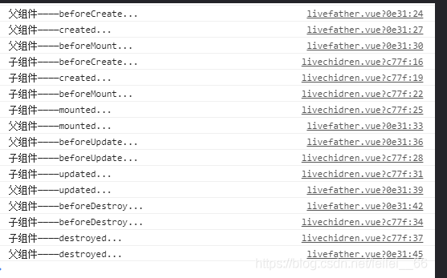

### 新增


**数据请求分为两级**一级为开局请求，请求到的下拉选项、input值绑在对应的区域，再通过其各种事件唤起各二级数据的请求

type === 0为内部会议  ，新增state为-1


审核人的选项approveList是自己请求会议室（meetRoomId）之后再用来请求的，绑在el-select的@change上，


写了个计算属性**userInfo**，赋这些东西，来做页面初始化显示，打开页面input框里就有东西

  this.formData.applicant = this.userInfo.userId

  this.formData.applicantName = this.userInfo.userName

  this.formData.recorderId = this.userInfo.userId

  this.formData.recorder = this.userInfo.userName

  this.formData.checkId = this.userInfo.userId

  this.formData.checkName = this.userInfo.userName

  this.formData.contactPerson = this.userInfo.userName


联系电话contactPhone也是获取的this.getMeetingUserInfo(this.userInfo.userId)		getMeetingUserInfo请求


**userInfo**应该是这个登录账号


#### 初始化会议室input框值，请求会议室、类型

会议室、类型由会议地点决定		handleUnitChange，初始化input框也在这里面显示

 this.getMeetingUnitRoom(val)

   this.getMeetingUnitType(val)


初始化框我还是没找到，我直接写在请求后面

#### 审核人由会议室决定，

getMeetingAuther 里的getMeetingAutherByRoom请求

申请人永远是不可点


#### 会议地点、会议室下拉栏选项

是个可以新增value的下拉选项

visible-change做判断，封装一下将创建的条目添加进下拉选项

用dom操作取到label（.el-input__inner），value 取label的值，this.formData.meetUnitId取value值

判断这个条目是不是下拉选项已有的

该下拉栏选项来自unitList


#### 纪要上传人和考勤人

共用级联选项


#### 开始、结束时间

在@change里面做的校验


#### 短信

短信是所有东西确认后请求的，利用的是@blur、@change

把上半部分和联系电话传给后端处理，返回的message内容，再填上去（为什么要后端做）

（详情这块直接是在表单里）


#### 创建条目没有用

因为胡乱创建条目，是请求不到会议室的，应该是想做搜索吧


所以我试着不做selectVisibleChange


### 详情

详情的话就是请求一次，然后填满各自的v-model就行了


input有可能是空的话，placeholder要做处理


级联的下拉选项也是在详情里面请求的，那新增里的是怎么来的？新增也调了下拉栏，useTemplate 新增调的这个


因为和新增共存问题，会议地点和审核人绑的都是id，详情中只做了回显，所以直接赋值成name就行，不影响


### Topic

更改页面思路，把detail直接换成form，topic直接作为form的子组件传进去

组件根本就没有解耦，又用refs，又用emit的

插管子的病人


展开逻辑：v-show控制

移动端的展开逻辑是用的overflow：hidden 加更改height（因为那个还要留一排出来）


#### 会议成果

会议纪要的材料上传人用的还是form的数据（formData.recorder），在Detail中通过调用putInfo获取，那我直接写个vuex存进去得了

考勤上传人：formData.checkName


会议纪要的添加的议定事项是上传纪要弹窗的数据回显，数据来源是来自传进**上传纪要弹窗组件**的事件，在点击提交按钮后触发的


#### 会议成果-上传纪要弹窗

直接用ref调用的里面的show方法来显示（dialogVisible）	（耦合太高了吧，我还得知道你里面有什么方法）

之前的直接用.sync，绑定点击方法

```vue
   <GreenDialog
      :dialogVisible.sync="dialogVisible"
      :title="title"
      :dialogHeader="dialogHeader"
      :dialogData="basicInfo"
    ></GreenDialog>
```

我做个下面的，传dialogData进去，赋dialogVisible为true

传进去的是formData

再上传个header进去得了


里面提交的表单包括：

```
private ruleForm = {
    fileLink: '',
    fileName: '',
    meetingId: '',
    meetingProcess: ''
  }
```


它绑定的确定事件，最后emit 触发外面的函数，来调用纪要来做回显

我用proxy试试，dialogVisible 为false的时候调方法做回显


#### 会议议题

这个里面内容都是请求的getMeetTopicList	topicList

param 是meetingId


也有个添加的弹窗，是新增特有的


共一个附件和下面写一个div


会议回执、关联内容、只能推荐都是写的组件


### 疑问

#### 已解决

为什么我的级联没有值


**写入整理里！**

我不写这个为什么就没有值

value: 'id', label: 'label', children: 'children',


v-model="formData.recorderId"

是不是它会去选项里自己组找值


应该是value值绑的就是value，props规定去找options里的id，就自己去找了，不写自然是找不到

这点和el-input不一样，input指就是值


// 根据父子组件生命周期执行顺序，子组件mounted会先执行，所以进去的时候发请求没有meetingId

 mounted () {

  this.getMeetTopicList()

 }



#### 未解决

几个页面连着一起的，照我自己的思路写没办法完成复原页面，没有管state啥的

思考更多了


vuex 页面存formData


MeetingControllerService 做的封装，都写的一样的那不就要封装一下了，

想试着改一下，不知道怎么改，没这么玩过，整不出创新的东西，只能讲点东西出来


和request那样 axios.create()写请求配置，玩拦截器不一样了，

什么时候要想到写成这样，感觉已经在玩源码了？


没有用.create get 啥的，直接用的AxiosInstance, AxiosRequestConfig

讲讲我的改写思路，真正开发逻辑思路又是怎么样的


 @include themify($themes) 


el样式穿透穿不到，选不对元素


 fileUpload(form, data, params => qs.stringify(params, { allowDots: true }))


会议纪要 显示附件有bug，文件可以有多个，议定事项只有一个，

传回来的是个list，里面的纪要都被赋成了最后一次上传的那个纪要


​     // el-upload自带success函数，看看和on-success事件是不是一样的

​     params.onSuccess(res.data, params)

#### 之前的疑问

van-list 的finshed的一些含义


没有了解.stop.prevent在这连用的用法


ht100  css样式