把拍完照的东西，签字的接口换成他们原生的安卓接口

签字要在图片上直接签字（现在是在自己的图片背景）

难点在于数据接过来做回显


# 疑问

map都没有动


生产的盒子

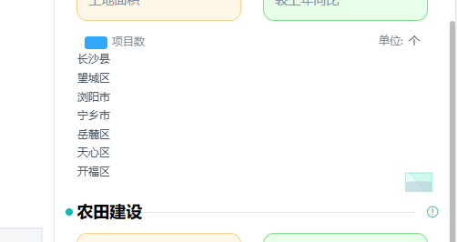


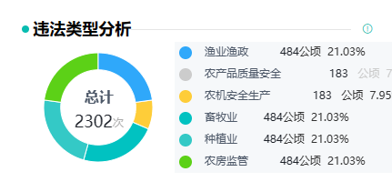

# 一体化平台

运维平台的farmlandProtect改成production


目的，为了演示去切图，不需要对接口

服务

- [x] 服务盒的三个页面，为切换的三个小标签，只改动了中间图标内容

src\modules\fuwu\views\serviceBox\views\serviceBox.vue

已完成右侧部分未做

生产

生产盒（农业生产监管盒）也是一个大页面，5个标签切换

耕地保护日常巡查监管统计（先完成这个，类似生产盒的农业生产一张图）

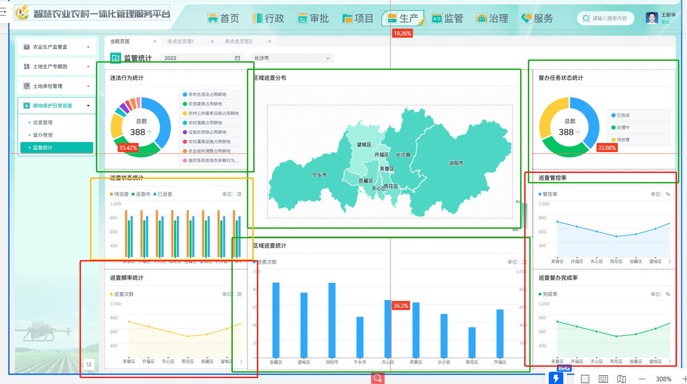

- [x] 监管


下的农业经营主题监管三个页面

处置结果的legand宽度不够


- [x] 治理

用的test


还有几个页面在另一个地址：https://codesign.qq.com/s/RMdGZQzn5MjXk8x
访问密码：XVGQ


面向ps编程，效果：有切换的需要做到切换效果，饼状图可以跟着换图


ZFJKPerChart		是饼图的

fuwu里的 XpBarChart	是封装好的只用传[{name,value}]		的饼图

生产里的

```
       <XpBarChartZ style="width:420px;height:180px" :legendData="['农田建设面积']"></XpBarChartZ>
```

是柱状图的


test里的 垃圾治理 用了  barline(柱线)

```vue
 <ZHXZBarLineChart style="width:420px;height:180px"></ZHXZBarLineChart>
```


# E-charts


[ECHARTS学习之dataZoom组件详解_拜水:问道的博客-CSDN博客](https://blog.csdn.net/qq_44610701/article/details/121394969)

[echarts的dataZoom详解及用法 - 简书 (jianshu.com)](https://www.jianshu.com/p/da5f4a4d92ae)


## 折线图

### 折线的圆点样式

[Echarts symbol 标记的图形 - 知乎 (zhihu.com)](https://zhuanlan.zhihu.com/p/376831728)

   series: [


​    {

​     name: '巡查次数',

​     type: 'line',circle

​     barWidth: 12,

​     barGap: '80%',

​     **symbol: 'pin',**

​     **symbolSize: [2, 2],**


## 流程

给宽高

```js
          <div class="chart-canvas" ref="xpPieChartRef"></div>
```


```js
  @Ref() xpPieChartRef!: any
```


**this.xPPieChartOneChart = echarts.init(this.xpPieChartRef)**

**this.xPPieChartOneChart.setOption(option)**

```js
 
  private xPPieChartOneChart: any = null
initXpPer () {
    this.xPPieChartOneChart = echarts.init(this.xpPieChartRef)
    const map: any = {
      立案处理: 486,
      移交管辖权机关: 735,
      移交司法: 580,
      其他: 484
    }
    let total = 0
    for (const mapKey in map) {
      total += map[mapKey]
    }

    const option = {
      title: {
        textAlign: 'center',
        left: '30%',
        top: '40%',
        text: '总计',
        textStyle: {
          color: '#4E5969',
          align: 'center',
          fontSize: 16
        },
        subtext: `{a|${total}}次`,
        subtextStyle: {
          rich: {
            normal: {
              textAlign: 'center'
            },
            a: {
              align: 'center',
              fontSize: 18,
              color: '#1D2129'
            }
          }
        }
      },
      tooltip: {
        trigger: 'item'
      },
      legend: [
        {
          data: ['立案处理', '移交管辖权机关', '移交司法', '其他'],
          left: '48%',
          width: '65%',
          height: '100%',
          orient: 'vertical',
          top: 'middle',
          backgroundColor: '#f6f8fa',
          // padding: [10, 20, 10, 10],
          right: 20,
          icon: 'circle',
          formatter: (name: any) => {
            return [
              // `{a|${((map[name] / total) * 100).toFixed(2)}%}`,
              ` {a|${name}}  {b|${map[name]}}公顷   {c|${((map[name] / total) * 100).toFixed(2)}%}    `
            ].join('\n')
          },
          textStyle: {
            rich: {
              a: {
                color: '#4e5969',
                fontSize: '12px'
              },
              b: {
                color: ' #1d2129',
                fontSize: '14px'
              },
              c: {}
            }
          }
        }
      ],
      series: [
        {
          type: 'pie',
          center: ['30%', '50%'],
          radius: ['45%', '70%'],
          avoidLabelOverlap: false,
          label: {
            normal: {
              show: false,
              position: 'inside',
              formatter: '{d}%'
            }
          },
          itemStyle: {
            borderRadius: 10,
            borderColor: '#fff',
            borderWidth: 1
          },
          color: ['#2fa8fa', '#00c362', '#fecd39', '#01c2c1', '#34C9C6', '#5CD117', '#EC8E48'],
          emphasis: {
            label: {
              show: false,
              fontSize: '20',
              fontWeight: 'bold'
            }
          },
          labelLine: {
            show: false
          },
          data: [
            { value: 486, name: '立案处理' },
            { value: 735, name: '移交管辖权机关' },
            { value: 580, name: '移交司法' },
            { value: 484, name: '其他' }
          ]
        }
      ]
    }
    this.xPPieChartOneChart.setOption(option)
  }
```

```js
moutend中加载		this.initXpPer()
```


## 捋页面

没有做缓存，直接刷新的页面，所以签字的数据是直接重新请求的vuex的数据

点击保存，会跳到未提交里去

点击提交，返回首页，提交到了抽样台账的已提交处


图片数组内容：

```
"data:image/png;base64,iVBORw0KGgoAAAANSUhEUgAAAZ4AAALlCAYAAAD0cYCQAAAAAXNSR0IArs4c6QAAIABJREFUeF7t3W/IXuddB/BLlNbWTdHS2o
```

会存到vuex里，然后返回的页面是重新加载的，又重新请求

之后改为带回id给h5页面（那我页面就不能vuex获取了吧，那怎么得到这个id，请求接口吗）


看看这个数据怎么来的

```js
this.formData[result].push(this.refSign.toDataURL())
```

push的this.refSign这个东西，这个东西就是canvas画布这个标签呀


```js
      <div class="chart-box">
            <div class="switch-wrapper">
              <div class="block-radio-group">
                <div :class="['radio-btn', { current: pieChartOneSwitch === 1 }]" @click="handleSwitchOneChange(1)">
                  项目分布
                </div>
                <div :class="['radio-btn', { current: pieChartOneSwitch === 2 }]" @click="handleSwitchOneChange(2)">
                  资金分布
                </div>
              </div>
            </div>
            <div class="fill-box">
              <div class="full-box" ref="pieChartOneRef"></div>
            </div>
          </div>
```


# 小积累

用el-*简便样式

el-flex

 el-flex-item-center

aligin-item：center

signature_pad插件 的电子签名

把画布变成签名版了？

```js
    const canvas: any = document.querySelector('canvas')
      this.signaturePad = new SignaturePad(canvas, {
        minWidth: 5,
        maxWidth: 10,
        // penColor: '#08BCB0',
        penColor: '#333',
        backgroundColor: '#ecfafa'
      })
```


项目里面用了插件把组件包装成了一个类，所以里面写的方法和其他地方不一样，其他都是赋给变量的，项目里写的是类方法，能用es6的简写形式


 overflow: auto;

滚动条


实习时间不固定，部门可以延长，可以请假

## 规划：

​	写项目：装东西，创项目，微信开发者工具的获取，数据持久化插件的安装和使用

​	看webpack


# Webpack

看一下构建过程和loader和pulgin的区别

### 自定义打包的入口与出口

在 webpack.config.js 配置文件中，通过 entry 节点指定打包的入口。通过 output 节点指定打包的出口示例代码如下:

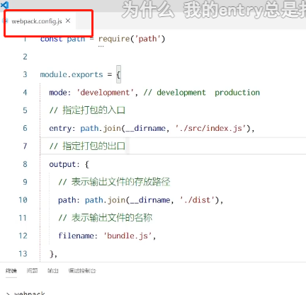

每次重新打包把dist文件夹删掉（防止冲突）

改完filename名字，自然的也要把引入的民资改掉


## 插件

每次 修改完之后 都要自己用npm run dev 自己打包

所以有什么能监听代码修改帮我们自动打包吗

那就要用到插件了


#### webpack 插件的作用

通过安装和配置第三方的插件，可以拓展 webpack 的能力，从而让 webpack 用起来更方便。最常用的webpack 插件有如下两个:
webpack-dev-server
0
类似于node.js 阶段用到的 nodemon 工具
每当修改了源代码，webpack 会自动进行项目的打包和构建html-webpack-plugin
webpack 中的HTML 插件(类似于一个模板引擎插件)
可以通过此插件自定制indexhtml页面的内容


配置插件

### webpack-dev-server

webpack-devserver 可以让 webpack 监听项目源代码的变化，从而进行自动打包构建

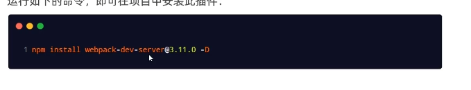

-D表示记录在开发节点下


2.2配置 webpack-dev-server
修改 packagejson -> scripts 中的 dev 命令如下
1"scripts": {
"dev":"webpack serve"，// script 节点下的脚本，可以通过 npm run 执行
再次运行 npm run dev 命令，重新进行项目的打包

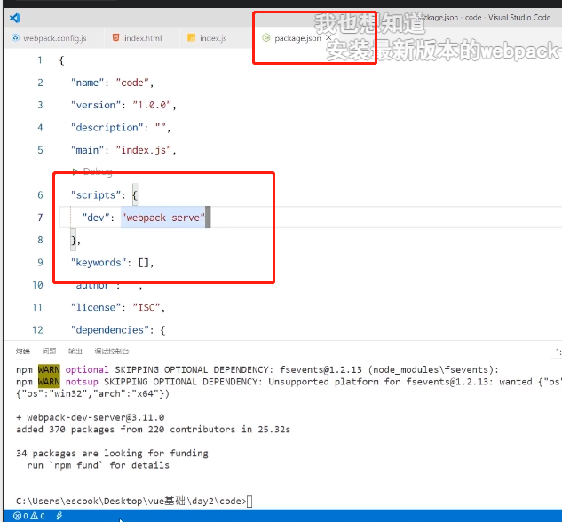


这样npm run dev之后会自动监听变化


### 访问自动打包生成的文件

之前的是webpack会严格按照配置的output去改引用，src下的文件就能使用了；

开启实时打包后，就不存在物理磁盘上了并没有在dist下


#### 2.3 打包生成的文件哪儿去了?

O不配置webpack-dev-server 的情况下，webpack 打包生成的文件，会存放到实际的物理磁盘上严格遵守开发者在webpack.config.js 中指定配置
根据 output 节点指定路径进行存放@配置了 webpack-dev-server 之后，打包生成的文件存放到了内存中不再根据output 节点指定的路径，存放到实际的物理磁盘上
提高了实时打包输出的性能，因为内存比物理磁盘速度快很多


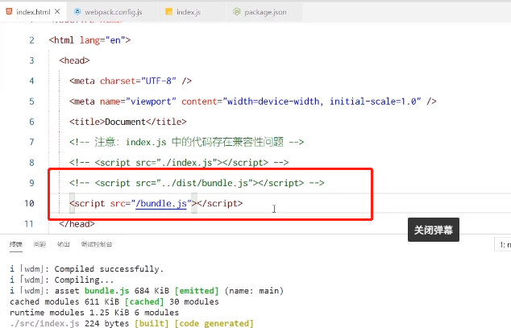


### html-webpack-plugin

html-webpack-plugin 是 webpack 中的 HTML 插件，可以通过此插件自定制 index.html页面的内容需求:通过 html-webpack-plugin 插件，将 sr 目录下的 index.html首页，复制到项目根目录中一份!


这样 打开端口就能看到页面了，而不是之前的那个文件夹

不需要dist 了，也不需要自己写那个首页的引入了，都是因为放到内存里和插件自己引用了


写在config.js里 ，很多配置是平级的写

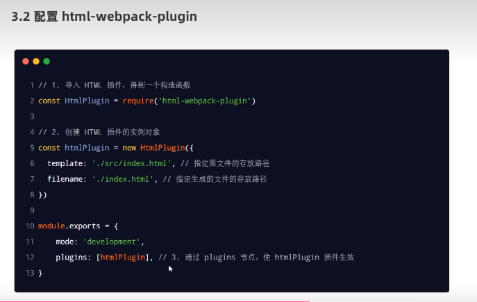


### 配置devserver节点

4.devServer 节点
在webpack.config,js 配置文件中，可以通过 devServer 节点对 webpack-dev-server 插件进行更多的配置示例代码如下:
i devServer :{
open: true，// 初次打包完成后，自动打开浏览器
host:127.0.0.1，// 实时打包所使用的主机地址
port: 80，// 实时打包所使用的端口号


## loader

就是处理非.js的文件咯 ，就有交给对应的加载器

1.loader 概述
在实际开发过程中，webpack 默认只能打包处理以.s 后缀名结尾的模块其他非 s 后缀名结尾的模块webpack 默认处理不了，需要调用 loader 加载器才可以正常打包，否则会报错!
loader 加载器的作用: 协助 webpack 打包处理特定的文件模块。比如:
css-loader可以打包处理css 相关的文件
less-loader 可以打包处理 less 相关的文件
babel-lader 可以打包处理 webpack 无法处理的高级JS语法


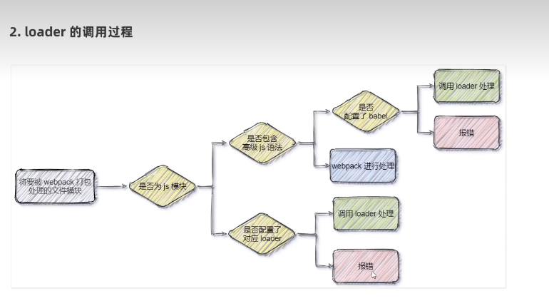


#### 打包处理css文件

当webpack发现处理不了import的css文件时，就开始调用配置好的loader，loader处理好再交给webpack进行打包合并

运行 npm i style-loader@2.0.0	 css-loader@5.0.1 -D 命令，安装处理 cs 文件的 loader


在webpack.config.js 的 module -> rules 数组中，添加loader 规则如下:

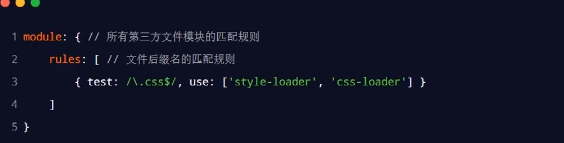1 module: { // 所有第三方文件模块的匹配规则
rules: [ // 文件后缀名的匹配规则
{ test: /\.css$/, use: ['style-loader'， 'css-loader'] )

其中，test 表示匹配的文件类型， use 表示对应要调用的 loader

注意: 
use 数组中指定的 loader 顺序是固定的
多个loader 的调用顺序是: 从后往前调用

### 打包处理less文件

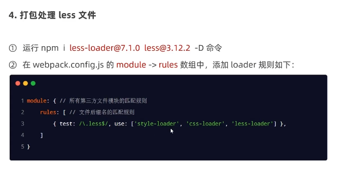

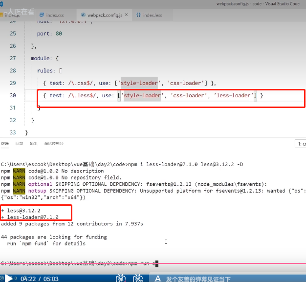


### url-loader

webpack5自动内置了

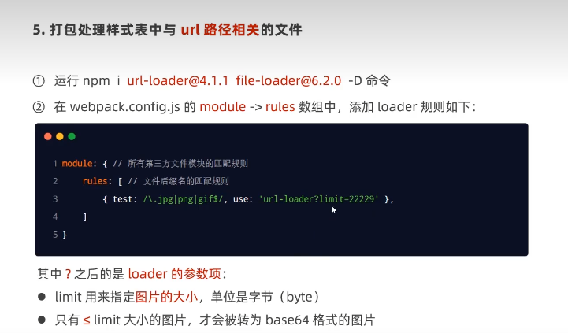


### loader对象配置方式

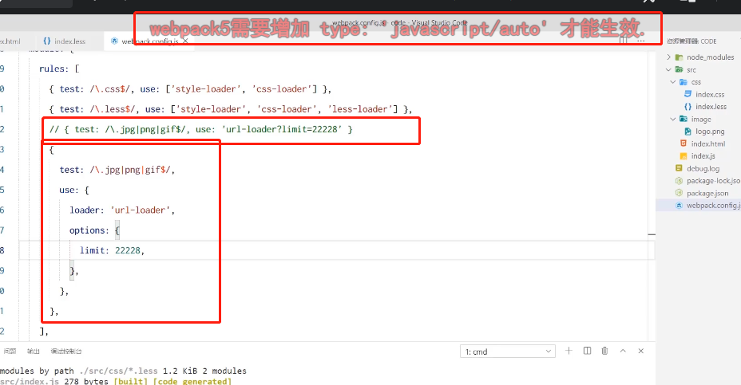


### babel-loader

最近版的兼容了

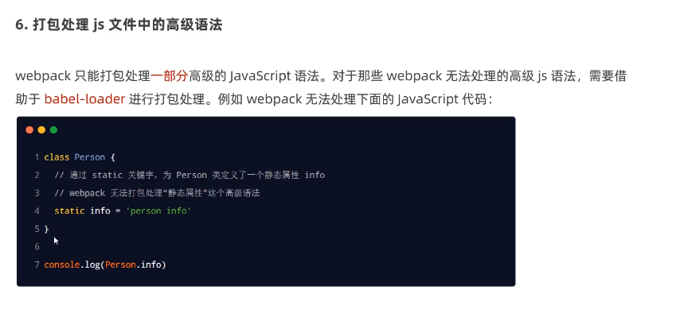


## 打包发布

### 为什么要打包发布

项目开发完成之后，使用 webpack 对项目进行打包发布的主要原因有以下两点:开发环境下，打包生成的文件存放于内存中，无法获取到最终打包生成的文件2开发环境下，打包生成的文件不会进行代码压缩和性能优化


加了server就是把它放进内存了

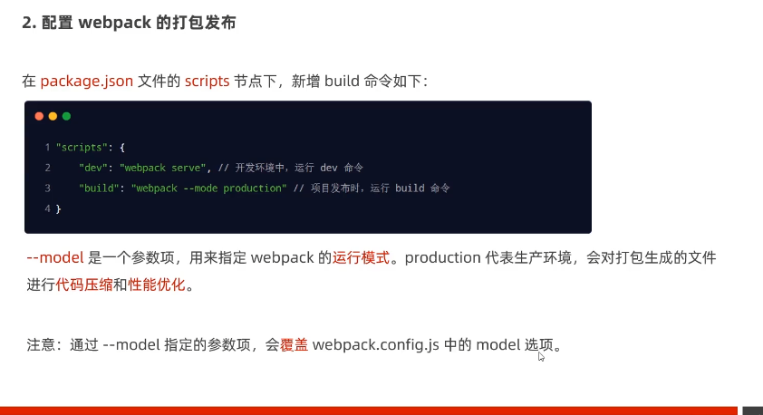


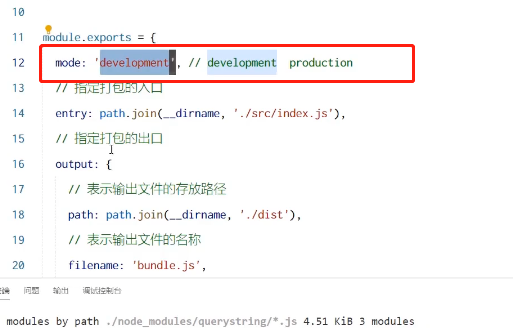


### 整理dist目录下的文件


用插件删除旧dist目录

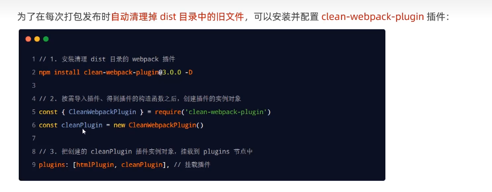


### 企业级项目的打包发布

企业级的项目在进行打包发布时，远比刚才的方式要复杂的多，主要的发布流程如下生成打包报告，根据报告分析具体的优化方案
Tree-Shaking
为第三方库启用CDN 加载
配置组件的按需加载
开启路由懒加载
自定制首页内容
在后面的 vue 项目课程中，会专门讲解如何进行企业级项目的打包发布


# Pinia

安装后使用，less是默认配置的不需要加


[一文搞懂pinia状态管理（保姆级教程） - 知乎 (zhihu.com)](https://zhuanlan.zhihu.com/p/533233367)


## 数据持久化

[pinia-plugin-persistedstate(基础) - 掘金 (juejin.cn)](https://juejin.cn/post/7255855818595024954)

[uniapp项目实战第五章：小程序Pinia持久化_极客李华的博客-CSDN博客](https://blog.csdn.net/qq_51447496/article/details/132346022)

# uniapp项目

## 文档

[小兔鲜儿 - 项目起步 | uniapp+vue3+ts (gitee.io)](https://megasu.gitee.io/uni-app-shop-note/rabbit-shop/)

安装huildX创项目


工具栏的工具点·下插件


运行的时候点微信开发者工具，绑路径


跑起来后有爆红

安全的服务端口	启动


微信开发工具，左边分离窗口


关系


命令行创建项目


首次用终端要装插件，然后再终端里装uniapp插件


微信开发者工具跑这之后的dist文件夹


### vscode开发

装插进


uni-helper


配置ts


设置允许注释

两个json的


去看笔记文档


## 拉代码

appid换成自己的


安装依赖

pnpm install


[Cannot find module '@dcloudio/uni-cli-i18n' - DCloud问答](https://ask.dcloud.net.cn/question/132878)


这样就有dist了


然后打开微信开发者工具导入dist


开启服务


直接保存vscode的代码，那边也能响应更新


tarbar在page.json


## 基础架构


 


对ui组件配置ts


### 状态管理

 注意敲


创建和添加store，这里用的是组合式写法


[一文搞懂pinia状态管理（保姆级教程） - 知乎 (zhihu.com)](https://zhuanlan.zhihu.com/p/533233367)


持久化写配置项

persist：true	不生效了

小程序有点不一样，不止要写这些，还要写那两个get、set基本结构


### 请求和上传文件拦截器


开始在左边页面写拦截器

把requset换个名字试试


uniapp拦截器

[uni.addInterceptor(STRING, OBJECT) | uni-app官网 (dcloud.net.cn)](https://uniapp.dcloud.net.cn/api/interceptor.html#addinterceptor)


添加了个对象到profile里面

{name，token}


## 首页模块

### 自定义导航栏

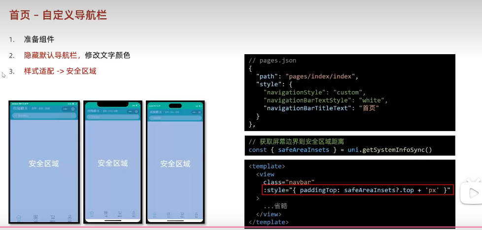


## 通用轮播图

组件类型声明


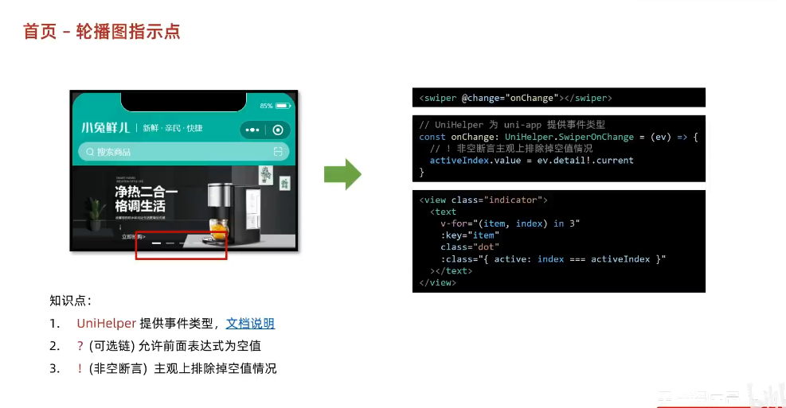


写接口和请求逻辑


写返回的类型BannerItem泛型的对象数组


解决方案：

`uni-ui` 组件库

pinia：Pinia 可以理解为就是 [Vuex5](https://pinia.vuejs.org/zh/introduction.html#comparison-with-vuex)，是一个**轻量级的、兼容 Vue 3 和 Vue 2 的状态管理库**。Pinia 和 VueX 主要区别是**废弃了**经常被认为是**极其冗余的 mutation**

 [pinia-plugin-persistedstate](https://github.com/prazdevs/pinia-plugin-persistedstate)数据持久化，并对小程序端兼容

默认使用 [localStorage](https://prazdevs.github.io/pinia-plugin-persistedstate/zh/guide/config.html#storage) 实现持久化，小程序端不兼容，所以必须修改一下配置，替换为 `uni-app` 支持多端的持久化 API，也就是 `uni.setStorageSync()` 和 `uni.getStorageSync()`。


请求拦截器，基于axios思想，封装了自己的网络请求库--`http` 函数，该函数返回一个 Promise 对象，支持泛型，方便处理返回数据的类型


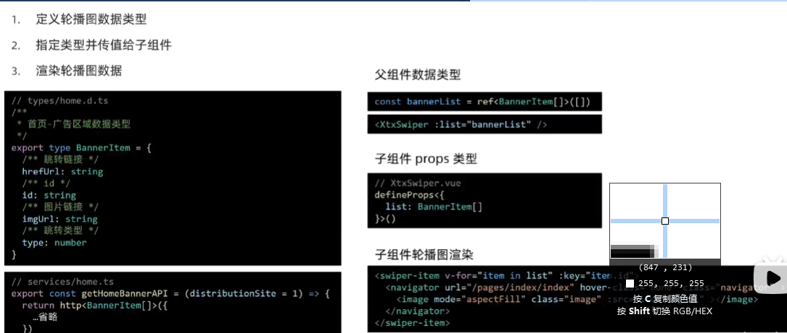

组件：easycom配置正则，自动导入组件

自定义导航栏（怎么实现的，安全区样式适配）

轮播图：easycom配置正则来自动导入组件，组件库不支持ts添加类型声明（UniHelper提供），

```js
const onChange: UniHelper.SwiperOnChange = (ev) => {
  activeIndex.value = ev.detail!.current
}
```

TS就是告诉你要注重类型，绑定事件要类型，导入组件要类型，prop要类型


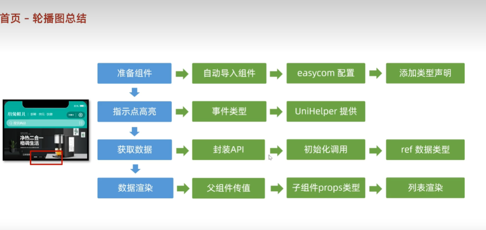

## 前台分类

