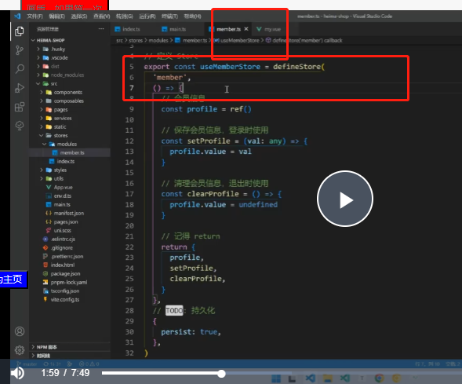

# 小积累

用el-*简便样式

el-flex

# uniapp项目

安装huildX创项目

工具栏的工具点·下插件

运行的时候点微信开发者工具，绑路径

跑起来后有爆红

安全的服务端口	启动

微信开发工具，左边分离窗口

关系

命令行创建项目

首次用终端要装插件，然后再终端里装uniapp插件

微信开发者工具跑这之后的dist文件夹

### vscode开发

装插进

uni-helper

配置ts

设置允许注释

两个json的

去看笔记文档

## 拉代码

appid换成自己的

安装依赖

pnpm install

这样就有dist了

然后打开微信开发者工具导入dist

开启服务

直接保存vscode的代码，那边也能响应更新

tarbar在page.json

## 基础架构

 

对ui组件配置ts

### 状态管理

 注意敲

创建和添加store，这里用的是组合式写法

[一文搞懂pinia状态管理（保姆级教程） - 知乎 (zhihu.com)](https://zhuanlan.zhihu.com/p/533233367)

持久化写配置项

persist：true	不生效了

小程序有点不一样，不止要写这些，还要写那两个get、set基本结构

### 请求和上传文件拦截器

开始在左边页面写拦截器

把requset换个名字试试

uniapp拦截器

[uni.addInterceptor(STRING, OBJECT) | uni-app官网 (dcloud.net.cn)](https://uniapp.dcloud.net.cn/api/interceptor.html#addinterceptor)

添加了个对象到profile里面

{name，token}

