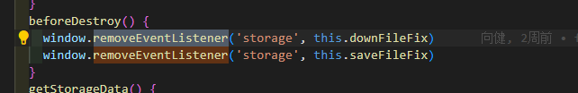
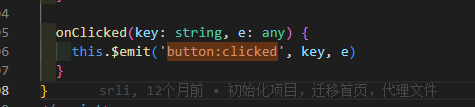
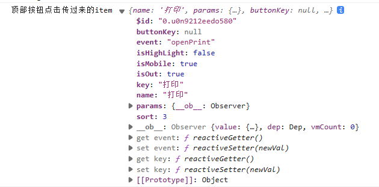
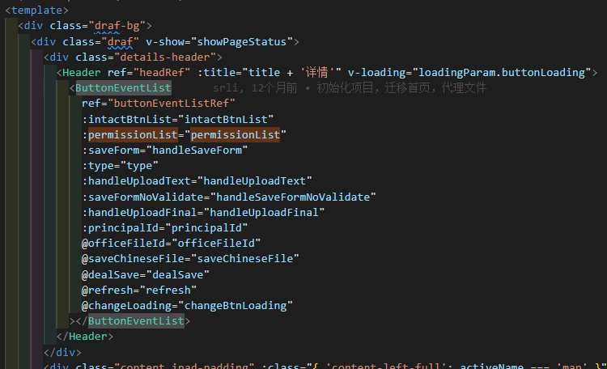
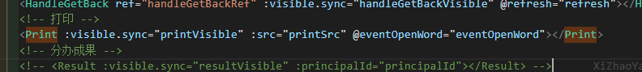
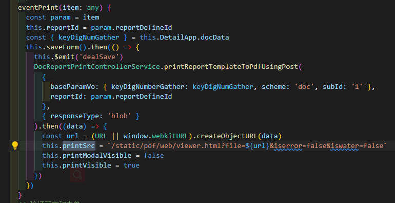
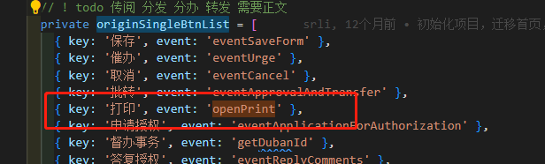
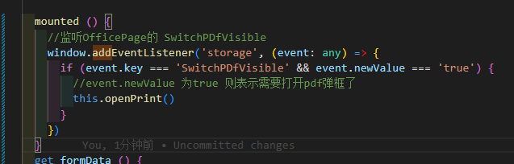
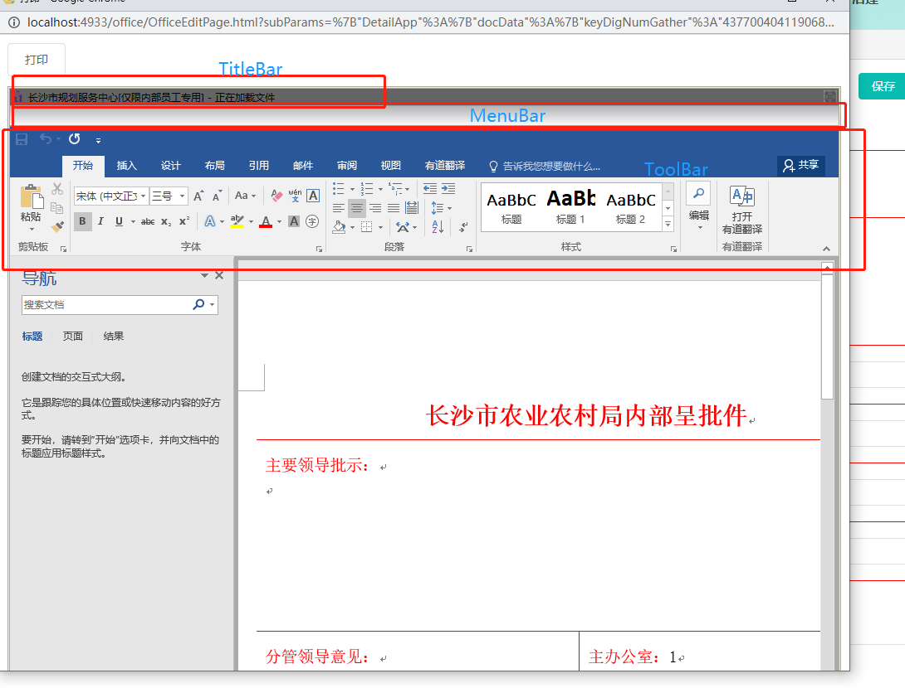
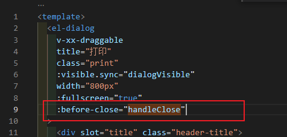

# 任务

- [x] 农业农村-公文管理-发文办理里，点个已审批的

点击打印，现在是先出来pdf格式的那个插件页面，然后点“word格式”，根据系统，跳到某一office的页面的签章


现在让它顺序互换，先进第二个（word格式），再点个啥？让它跳到第一个（pdf格式）


这两个页面都是很多地方共用的，注意参数


- [ ] 事务管理->事务办理，打印是下拉栏的，也把它改成打开的是word的

这边和公文（?）的是强绑定的，现在不需要了，通通甩掉


把打印事件里的

```js
 OfficeHandler.goto文件打印({ resource: `?file=${url}`, params: data, current })
```

换成window.open的word的那个

注意参数的传递 			--现在把showOffice搬过来了，因为buttonList的是一股脑把公文Detail的this给哪过来了，不知道哪些参数才是必须的，

直接把页面改成OfficeOriginPage也是能跑的，现在比较下OfficeOriginPage里的参数，看看就用Edit里getPrintList的res那几个打印列表的参数能不能成功


里面有个api是和word相关的


把Edit里要传的参数给传过去


把获取按钮权限的方法去掉

把storeId换成 process

把下载地址的doc换成process

把鉴权文档换成公文的

把webUrl的参数给对上


# 疑问

PrintDialog里的

PdfPanel是怎么实现打印那些工具的

只看到个iframe，完全没看懂


- 去看openPrint和里面调用的eventPrint怎么处理src等数据的和调方法


还有list怎么处理数据


- 看怎么跳到OfficePage这个独立网页的

也就是看看showOffice这个方法		--window.open，传到系统固定的路由的地方，并序列化传进需要的参数

[Window：open() 方法 - Web API 接口参考 | MDN (mozilla.org)](https://developer.mozilla.org/zh-CN/docs/Web/API/Window/open)


- 看看word和pdf是怎么冒出来的


detail里怎么只remove这两个，其他的不管了吗




- 接变量我能理解，这么接this有其他好处吗，感觉看着好混

也是不出于让它去全局查找变量，所以节省开销的目的吗

```js
   initOffice() {
        return new Promise(resolve => {
          this.$nextTick(() => {
            const that = this
```


- 这个算闭包吗，为什么要这么做 				--为什么不直接return	WebOffice去赋给this.xx

掌握下这种写法

```
      getOffice() {
        let WebOffice
        return () => {
          if (WebOffice) return WebOffice
          WebOffice = new window.WebOffice2015()
          const obj = document.getElementById('WebOffice2015')
          WebOffice.setObj(obj)
          WebOffice.SetCaption('')
          WebOffice.ShowTitleBar(false)
          WebOffice.ShowMenuBar(false)
          WebOffice.ShowToolBars(true)
          WebOffice.HookEnabled()
          WebOffice.Skin('black')
          return WebOffice
        }
      },
```

我什么时候要想到这么做，如果让我来写我只会然后回 WebOffice赋给变量去使用	


--代哥说就是简单的单例模式

通过闭包保留对实例的引用，确保只有一个实例存在，并且可以通过暴露的方法来获取该实例


- data里有个变量和函数名一样，就是一个东西吗

vue2里也这么在data数据可以变量赋方法的吗

vue2可以直接在data里存方法吗

```
        that.initOfficeInstance = that.getOffice()
                that.initOfficeInstance()
```


为什么不直接this.getOffice()		

```
   that.initOfficeInstance = that.getOffice()
                that.initOfficeInstance()
```


- 这样定义符合规范吗




事务处理Edit

为什么按钮还有从后端返回

```
 const res = await ProcessHandleApi.getButtons(params)
```

这样就是做按钮级的权限了吗


# 疏通


## Detail

打印组件里的  点击word格式 跳转的那个东西，不依赖其他东西

```vue
 <el-button type="primary" plain @click="eventOpen()">word格式</el-button>

  eventOpen() {
    this.$emit('eventOpenWord', true)
  }
```

直接用的父组件的东西，没有其他关联 ---完全可以抽出来，放在任意地方


详情父组件里的

```js
  eventOpenWord() {
    this.showOffice(true)
  }
```


详情里面：@Provide() DetailApp = this

buttonEventList:	 @Inject() DetailApp!: any

### buttonEventList

所以可以把详情里的打印按钮		点击事件换成eventOpenWord

可以把打印按钮直接替换成这个，然后把格式里的按钮换成打印

应该能直接用emit回调


目前在看打印的点击事件，怎么只有加载栏的，不止

点击出现，加载完延迟1500ms再关闭

```js
 // this.openPrint(item)
await (this as any)[item.event](item)
```

主要目的就是利用emit可以传入参，**根据传入的list的内容在父组件里去巧妙执行对应的事件**，

转入的是文本，调用的事件




### 整个页面顺序：

​	detail里的index是整个页面 --> 到Header里ButtonEventList就是整个按钮组（看看传进的东西，）

Print弹窗组件在ButtonEventList里


详情：




ButtonEventList里的Print组件

在eventPrint里printVisible被赋成了true，同时也处理了printSrc，传给子组件eventOpenWord作为打开02的点击事件



那我把这些全搬到OfficePage里？

 看看他们两者是什么是什么关系，OfficePage里点击直接写个emit让它触发写好咱们写好的函数去赋printVisible


printVisible只有在eventPrint里被赋成了true，同时也处理了printSrc，



eventPrint只在两处被调用 ----	openPrint函数和另一处，另一处不知道干什么的printModalVisible，也被赋成true，可我为什么我没看见过它

打印弹框和打印弹窗		？？？为什么要这么做


openPrint函数只和originSingleBtnList对象的数组关联上了（根本不知道openPrint是什么时候被调的）




originSingleBtnList在@Watch('permissionList',出现了

应该是在里面赋按钮权限,在里面赋了firstList传给了ButtonGroup子组件，ButtonGroup子组件用list接受并监听处理成localList去使用


所以处理打印弹框就是处理  this.eventPrint(data[0])事件


## OfficePage

public\office\OfficePage.html


!isView条件渲染显示一排没用的按钮


有东西时

```html
<div id="container"></div>
```


尝试使用window.localStorage存储个东西，然后跳回去，在回去那个页面想办法取出来


在detail里想办法调用openPrint ---直接把监听放ButtonGroup里




created里

queryParams: getRequest(),是直接调函数去解析url（去掌握下接过来的技巧）


```js
   beforeDestroy() {
      window.removeEventListener('beforeunload', this.setCloseData)
    },
```

通过localStrorang去设置标志位OfficePageVisible，detail那边因为mounted就有监听器，能够监听到，所以会根据标志位觉得去刷新页面


## 事务办理Edit

看页面：先看prop，简单的看一下watch，然后根据钩子函数去找

从监听selectedFormItem里找到

 请求表单列表loadFormList

找到init()


**mounted调用了enterDo**

重视起来

从this.$xxTab.getArgs()里请求subParams赋给comParam

```
 this.comParam = subParams
 ...
    this.init()
    this.followInit()
    this.getCounterTableInfo()
```

**所以comParam就是this.$xxTab.getArgs().subParams转过来的东西**


**init**

```js
...
//看看saveStartForm有啥用
    this.saveStartForm = false
    this.loadFormList()
```


**长长的loadFormList方法**

 // 请求表单列表


util里面遍历树结构数组的方法 recursionTree

用map遍历数组的每一个元素，做你传入的方法（第二个参数），然后做遍历children节点


在这里selectedFormItem被赋值了，监听器生效

```js
   this.selectedFormItem = item
      this.formName = item.label
      this.formInfo = item
```


 @Watch('selectedFormItem')	-->		switchForm	-->	initBtn-->


**getPrint**

请求打印列表

```js
const res = await ProcessHandleApi.getPrintList(this.comParam)
```


buttonEvents		对应的按钮事件数组

```js
 switch (el.reportType) {
         ...
case 1:
            this.printSub.push({ key: el.description })
            this.buttonEvents[el.description] = () => {
              this.printThings(el, (el.subIdList && el.subIdList[0]) || '0')
            }
```

根据返回的文件的类型的描述（description:呈批件），添加调用（ this.printThings）生成新的打印事件？


printThings

两者是同一个东西

```js
 this.$xxTab.open('office', '文件打印', { resource: `?file=${url}`, params: data, current })
      // OfficeHandler.goto文件打印({ resource: `?file=${url}`, params: data, current })
```

第二个是自己封装的：

打开标签页

```js
 static goto文件打印(options = {}) {
    tabInstance.open(getModuleName('office'), '文件打印', options)
  }

...
export const tabInstance = new Tab()
```


$xxTab就是挂载在vue上的这个Tab

```js
 $xxTab: Tab
```


```js
   OfficeHandler.goto文件打印({ resource: `?file=${url}`, params: data, current })
```

cuurent就是list接口返回的东西


  const data = {

   keyDigNumberGather: this.comParam.keyDigNumGather,

   scheme: 'PROCESS',

   subId: subId,

   procDefId: this.comParam.procDefId

  }

```js
   {
        "procDefId": "process_2:1:1575386308770140160",
        "keyTypeCode": 2,
        "reportDefineId": "318035897764802560",
        "reportId": "317316685605892096",
        "description": "呈批件",
        "orderIndex": 0,
        "reportType": 1,
        "subIdList": null
    }
```


## Edit的office

先在getButtonPermission里调api获取按钮权限，在根据bottonList赋值

在initOffice里初始化WebOffice

然后用这个打开内容handleOpenNormalFile


起码是需要这个的

   data: this.DetailApp.docData


好像打开是不需要fileLinkId的

```js
   office.WebUrl = `${docFile}?reportId=${reportId}&keyDigNumGather=${keyDigNumGather}`
```

这样就行了


this.docData是来自detail里的

@inject引过来的DetailApp


detail里的docData来自docPublicData

```js
  initDocData() {
    if (this.docPublicData.keyDigNumGather) {
      Object.assign(this.docData, this.docPublicData)
    } else {
```


但docPublicData直接在vuex里取的


现在代哥直接用的公文的，还没换成事务的那些，所以验证auth肯定能过

TODO

​    // 222222222 事务认证

​    axios({

​     url: '/api/doc/paper/file/auth',

- [ ] 事务认证换接口

- [ ] 地址变了

```js
const docFile = window.location.protocol + '//' + window.location.host + '/api/doc/printReportTemplate/toWord'
```

- [ ] 变storeId

const storeId = 'doc'





# BUG

一轮bug

国产机上点击打印的弹窗的word的页面，没有显示文档

关闭后遮罩层一直存在


可能有些东西和pdf的有关

打不开的原因reportId为空


接下来就看这个reportId从哪来的

目前发现在openPrint里获取接口的.then的数据

我是直接把那个接口搬过来再请求一次的，也可以把那个接口另装在一个函数里，像荣哥那样


我用保存关闭按钮，却是保存到了正文


收文办理中，点开详情，点击打印从word跳pdf里，再x掉

再进入发文办理里，干同样的是事，最后x掉，遮罩层一直存在



```js
  handleClose (done: () => void) {
    this.$emit('update:visible', false)
    done()
  }
```

去掉这个就没有触发了


# 积累

- 收获了一种处理多个调用事件的方法


用数组存所有按钮名字和事件的信息，遍历生成结构

统一写click，在里面据元素的事件名字去找对应的方法


这样，父组件里只需要prop传入子组件，子组件渲染模块，也能用emit处理事件


[Window：open() 方法 - Web API 接口参考 | MDN (mozilla.org)](https://developer.mozilla.org/zh-CN/docs/Web/API/Window/open)

[存储 - Web API 接口参考 |多核 (mozilla.org)](https://developer.mozilla.org/zh-CN/docs/Web/API/Window/storage_event)

[使用 Web Storage API - Web API 接口参考 | MDN (mozilla.org)](https://developer.mozilla.org/zh-CN/docs/Web/API/Web_Storage_API/Using_the_Web_Storage_API)


- 回退提交


git reset --soft HEAD^


- 不仅可以用watch去监听，

 还可以直接加window.addEventListener('load', this.refresh, false);  （在beforeDestory里销毁）


- 在方法里面先用个变量把this存起来

防止后续this变化了，和前面的this不一样，（也算是个小技巧吧）


- 闭包与单例模式


- 闭包的运用


**`join()`** 方法将一个数组（或一个[类数组对象](https://developer.mozilla.org/zh-CN/docs/Web/JavaScript/Guide/Indexed_collections#使用类数组对象)）的所有元素连接成一个字符串并返回这个字符串，用逗号或指定的分隔符字符串分隔


**`split()`** 方法接受一个模式，通过搜索模式将[字符串](https://developer.mozilla.org/zh-CN/docs/Web/JavaScript/Reference/Global_Objects/String)分割成一个有序的子串列表，将这些子串放入一个数组，并返回该数组。


 $xxTab: Tab

和

```js
 tabInstance.open(getModuleName('office'), '通知详情', { ...options, messageVo: res })

export const tabInstance = new Tab()


```


 this.$xxTab.open('office', '文件打印', { resource: `?file=${url}`, params: data, current })

和	this.$xxTab.getArgs()里请求参数形成闭环


# 项目积累

## WPS

国产操作系统上，用的是wps


this.officeInstance = this.webOffice.getEditor()


页面中调用init()方法，传入标签id，进入getEditor，把ifame放进id里

```js
  this.getEditor = function(target) {
    if (!this.wpsEditor && target) {
      let iframe
      iframe = document.getElementById(target)
      if (iframe.innerHTML.indexOf('application/x-wps') > -1) {
        iframe.innerHTML = ''
      }
      let codes = []
      codes.push(
        "<object  name='webwps' id='webwps_id' type='application/x-wps' uistyle='ribbon'  width='100%'  height='100%'> <param name='Enabled' value='1' />  </object>"
      )
      iframe.innerHTML = codes.join('')
      const obj = document.getElementById('webwps_id')
      this.wpsEditor = obj.Application
    }
    return this.wpsEditor
  }
```

```js
application/x-wps是一种文件格式，它是由金山WPS办公套件使用的一种特定文件类型。
```


完成初始化，然后加载公文

带着url、reportId、Authorization等，进OpenDocumentFromServer


优化：结合windows实现跨页面传数据，优化页面逻辑


## 金格WebOffice

所以业务流程就是去配合金格webOffice（见上的疏通）


```js
         office.WebUrl = WebUrl
          office.FileType = FileType
          office.Caption = '正在打开文档...'
          office.FileName = 'processPrint' + '_' + this.GetCurTimeStr() + '.doc'
          office.iWebOfficeTempName = 'processPrint' + '_' + this.GetCurTimeStr() + '.doc'
          office.obj.FuncExtModule.WebCreateProcess() //创建空进程优化打开慢
          office.WebObject.Style.ShowOpenProgress = true //开启打开文档时的进度条
```

传入了这个WebUrl

还有这些

```js
    let formData = {
            query: {
              storeId: 'process',
              reportId,
              keyDigNumGather
            },
            body: paramsData,
            Authorization: getCookie('business_access_token')
          }
```

最后调方法

office.WebOpen(formData)

​		SetRequestHeader('Authorization'、.AddForm('signature'

​		这里面调用	this.LOADFILE(httpclient)		----异步请求回来数据，看看服务器有没有返回文件

​				里面调用  httpclient.Open(this.HttpMethod.Post, this.WebUrl, false)

httpclient是http对象			

​	最后httpclient.Clear()

服务器返回 一个文件，并保存到本地做临时文件（存储地址、保存的名字就是之前传入的fileName、Path啥的）

然后打开这个本地文件		this.OpenLocalFile(this.FilePath + this.FileName)		 return this.obj.Open(filePath)


1. **open()**：用于初始化一个请求，指定要发送的请求类型、请求的URL地址以及是否使用异步请求等参数。
2. **send()**：用于将请求发送到服务器。


利用


## 打印PDF格式

获取打印列表（用keynumId去拿reportId等信息）

拿到reportId然后去请求pdf格式的文件，就是blob流（url），去拼接printSrc

```
/static/pdf/web/viewer.html?file=${url}&iserror=false&iswater=false
```

 this.printVisible = true，传入pdf显示组件

里面做渲染的是个ifame，:src="viewerUrl"（里面好多工具类）

# TODO

- [x] 哪些方法会改变数组本身，哪些不会

不会改变数组本身的方法，其实就是说它会创建一个副本，或者就是在原数组上改动的

会改变的我愿称之为原始的7种（增删改排），


[JS数组方法中哪些会改变原数组，哪些不会？ - 掘金 (juejin.cn)](https://juejin.cn/post/7107415332666474504)

- [x] apply、bind和call的区别


- call、apply与bind的差别

> call和apply改变了函数的this上下文后便执行该函数,而bind则是返回改变了上下文后的一个函数。

- call、apply的区别

> 他们俩之间的差别在于参数的区别，call和apply的第一个参数都是要改变上下文的对象，而call从第二个参数开始以参数列表的形式展现，apply则是把除了改变上下文对象的参数放在一个数组里面作为它的第二个参数。

bind可以动态传参，创建的时候、调用的时候可以传剩余的参

1. 在调用bind的时候，就可以开始给greeting传递参数。上面的例子当中，我们把’the world’作为greeting的第一个参数。
2. 我们在调用objGreeting这个函数的时候，再传入剩余的参数


```
call(thisArg, arg1, arg2, /* …, */ argN)
```

```
apply(thisArg)
apply(thisArg, argsArray)
```

调用 `func` 时提供的 `this` 值。如果函数不处于[严格模式](https://developer.mozilla.org/zh-CN/docs/Web/JavaScript/Reference/Strict_mode)，则 [`null`](https://developer.mozilla.org/zh-CN/docs/Web/JavaScript/Reference/Operators/null) 和 [`undefined`](https://developer.mozilla.org/zh-CN/docs/Web/JavaScript/Reference/Global_Objects/undefined) 会被替换为全局对象，原始值会被转换为对象。


**备注：** 这个函数与 [`call()`](https://developer.mozilla.org/zh-CN/docs/Web/JavaScript/Reference/Global_Objects/Function/call) 几乎完全相同，只是函数参数在 `call()` 中逐个作为列表传递，而在 `apply()` 中它们会组合在一个对象中，通常是一个数组——例如，`func.call(this, "eat", "bananas")` 与 `func.apply(this, ["eat", "bananas"])`。


手写call

要做的事：1.改变this指向给传进来的第一个对象，2.从call函数传入的第二个参数开始，作为调用的参数传入	3.不更改person和person1的任何属性和方法

实现：赋默认this；手动创个新属性方法，手动赋过去；再传参代为执行方法目的是为了保存执行结果return出去；有了结果只会卸磨杀驴delete方法

```js
Function.prototype.myCall = function(context, ...args) {
  // 如果没有传入上下文，则默认为全局对象（浏览器环境下为 window）
  context = context || window;

  // 将当前函数作为上下文对象的一个属性
  context.fn = this;

  // 在指定的上下文中调用函数，并传递参数
  const result = context.fn(...args);
	//apply就是这里不一样呗    

  // 删除在上下文对象中添加的函数属性
  delete context.fn;

  // 返回函数调用的结果
  return result;
};
```


[前端面试题——自己实现bind - 知乎 (zhihu.com)](https://zhuanlan.zhihu.com/p/85438296)

[5分钟快速手写实现：bind - 掘金 (juejin.cn)](https://juejin.cn/post/7080070296090181646)

[让你弄懂 call、apply、bind的应用和区别 - 掘金 (juejin.cn)](https://juejin.cn/post/6844903567967387656?searchId=20230928093544E6CA8E8BC694E684576F#comment)

[前端面试题——自己实现call和apply - 知乎 (zhihu.com)](https://zhuanlan.zhihu.com/p/83523272)

- [ ] 前端性能优化的手段

用cdn，减少各种缓存，减少cookie，多用外部css、js文件，css中图片使用精灵图、少用import、判断语句，css写在顶部、js写在底部

减少HTTP 请求数
减少 DNS 查询
使用 CDN		静态资源尽量使用CDN加载
避免重定向
图片懒加载
减少 DOM 元素数量
。减少 DOM 操作
使用外部 JavaScript 和 CSS
CSs 、字体、图片等压缩 JavaScript
优化 css Sprite
使用 iconfont
字体裁剪
多域名分发划分内容到不同域名
尽量减少 iframe 使用
避免图片 src 为空
把样式表放在 1ink 中
把 JavaScript 放在页面底部


- [ ] 禁用按钮的两种原生方法


- [ ] 数据类型和typeof、instanceof和其他判断数据类型的方法

  typeof 判断原始类型（6种，null、function、[]、{}为object）

  

  **null这个基本类型无法显示，只会是object**

  ```js
  typeof 42; // "number"
  typeof "hello"; // "string"
  typeof true; // "boolean"
  typeof undefined; // "undefined"
  typeof null; // "object" （这是历史遗留问题）
  typeof {}; // "object"
  typeof [] // "object"
  typeof function() {}; // "function
  ```

  

  `instanceof` 运算符用于检测构造函数的 `prototype` 属性是否出现在某个实例对象的原型链上，返回一个布尔值

  ​		使用如下：

  ```
  object instanceof constructor
  ```

  `object`为实例对象，`constructor`为构造函数

  只能用于判断对象是否是某个构造函数的实例，而无法准确判断原始类型

  ```js
  var arr = [1, 2, 3];
  arr instanceof Array; // true
  
  var obj = {};
  obj instanceof Object; // true
  
  function Person() {}
  var person = new Person();
  person instanceof Person; // true
  person instanceof Object; // true（Person 是 Object 的子类）
  ```

  

  

  TS是不是又加了一种数据类型？

  对现在是7+1(Bigint)


- [ ] URL从输入到页面显示发生了什么

简单的、详细的都看一遍

- [ ] 防抖节流

防抖

闭包存定时器，return function

存this，调用方法时apply要用上的


每次调用时，如果有定时器在，就重新计时

```js
if (timer) clearTimeout(timer)
timer = setTimeout(O => [fn.apply(context，args)}，wait)
```


节流

```js
function thorttled(fn,delay){
  let timer = null
  let startTime = Data.now()
  return function(){
    let that = this
    let curTime = Data.now()
    let remaining = delay - (curTime -startTime)
    clearTimeout(timer)
    
    if(remaining<=0){
      fn.apply(that,arguments)
      startTime = Data.now()
    }
    else{
      timer = setTimeout(fn,remaining)
    }
  }
}
```


- [ ] 双向绑定原理


websocket


下周开招聘流程，人事通知

笔试面试，做好准备，询问流程和大概笔什么面什么


css、js、数据结构的算法

不考框架ts这些

类型检测