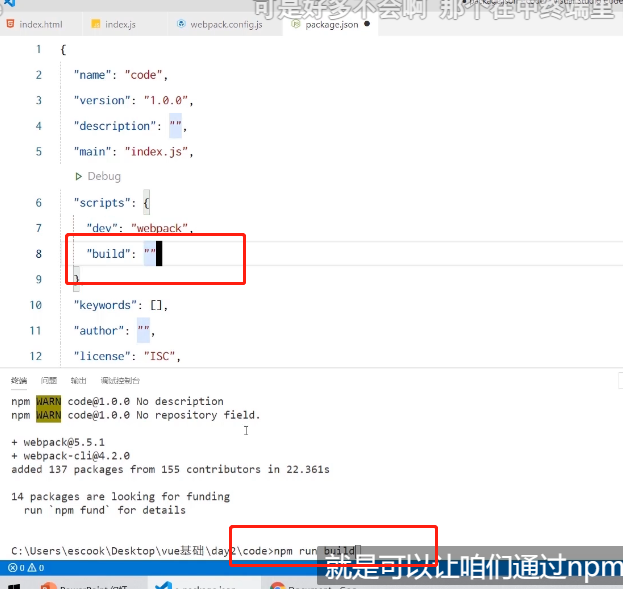

直接使用ES6、jQuery会不兼容报错


## webpack 的基本使用

3在项目中安装 webpack
在终端运行如下的命令，安装 webpack 相关的两个包:
1 npm install webpack@5.5.1 webpack-clig4.2.0 -D


### 在项目中配置 webpack

O在项目根目录中，创建名为 webpack.config,js 的 webpack 配置文件，并初始化如下的基本配置:
1 module.cxports = {
mode: 'development?// mode 用来指定构建模式。可选值有 development 和 production


在 package.json 的 scripts 节点下，新增 dev 脚本如下:
定

```js
1 "scripts":
"webpack”// script 节点下的脚本，可以通过 npm run 执行。例如 npm run dev
31
```




然后就执行npm run dev，就会制动执行webpack脚本

目录下就会多dist文件夹，把东西都放到main.js

